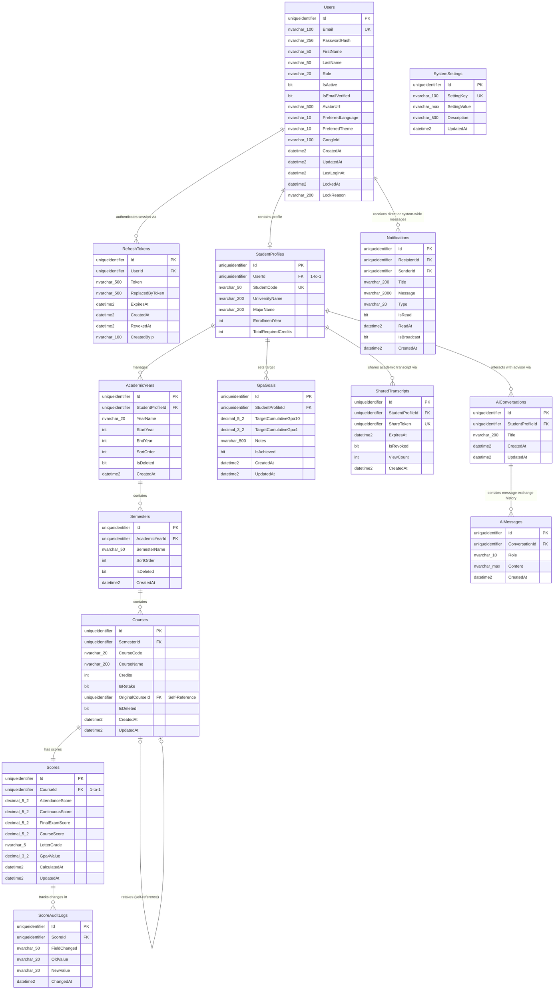

# 02 — Entity-Relationship Diagram (ERD)

> **Document ID**: DB-ERD-001  
> **Version**: 1.0  
> **Last Updated**: June 2026  
> **Status**: 🔄 In Review  
> **Format**: Mermaid crow's foot diagram notation

---

## 1. Relational Entity Relationship Diagram

The diagram below maps all tables, keys, column data types, and relational cardinalities in the database.

---

## 2. Cardinality Rules & Design Decisions

1.  **Users to StudentProfiles (1-to-0/1)**: A generic user can exist without a student profile (e.g., an Admin account). However, a student profile must link to exactly one User record.
2.  **StudentProfiles to AcademicYears (1-to-many)**: A student can manage multiple academic years. Academic years are owned by a single student profile.
3.  **AcademicYears to Semesters (1-to-many)**: Each academic year contains multiple semesters (enforced to a maximum of 3 by application logic).
4.  **Semesters to Courses (1-to-many)**: A semester contains multiple courses. A course belongs to exactly one semester.
5.  **Courses to Scores (1-to-1)**: Every course has exactly one linked score record. Keeping scores in a separate table keeps the `Courses` table clean and allows isolation of audit logging processes.
6.  **Courses to Courses (0/1-to-0/1 Self-Reference)**: Represents retaken courses. A retaken course points to its `OriginalCourseId`.

---

*End of Document — ERD*
