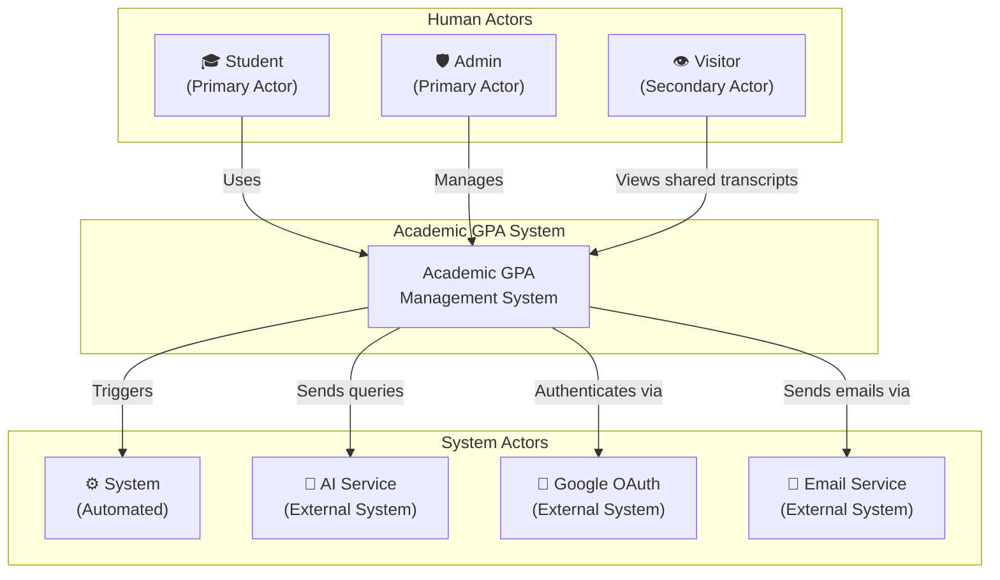

# 07 — Actors

> **Document ID**: SRS-ACTORS-001  
> **Version**: 1.0  
> **Last Updated**: June 2026  
> **Status**: 🔄 In Review

---

## 1. Actor Overview Diagram



---

## 2. Human Actors

### 2.1 Student (Primary Actor)

| Attribute | Value |
|-----------|-------|
| **Actor ID** | ACT-01 |
| **Name** | Student |
| **Type** | Primary Human Actor |
| **Description** | A registered university student who uses the system to track academic performance, calculate GPA, plan goals, and receive AI-powered academic advice. |
| **Multiplicity** | Many (thousands of concurrent students) |
| **Authentication** | Email/password or Google OAuth |
| **Authorization Level** | Standard user — access to own data only |

**Responsibilities:**
- Register and manage their own account
- Create and organize academic structure (years, semesters)
- Add courses and input component scores
- View calculated GPAs and statistics
- Set goals and use prediction tools
- Interact with AI academic advisor
- Generate and manage transcript sharing links
- Receive and manage notifications
- Configure personal preferences (theme, language)

**Characteristics:**
- Vietnamese university students (18–30 years old typically)
- Comfortable with web and mobile technology
- May prefer Vietnamese or English interface
- Uses the system periodically (after exam periods, during registration)
- Peak usage during midterm and final exam periods

**Access Rights:**

| Resource | Create | Read | Update | Delete |
|----------|--------|------|--------|--------|
| Own Profile | ✅ (via registration) | ✅ | ✅ | ❌ |
| Own Academic Years | ✅ | ✅ | ✅ | ✅ (soft) |
| Own Semesters | ✅ | ✅ | ✅ | ✅ (soft) |
| Own Courses | ✅ | ✅ | ✅ | ✅ (soft) |
| Own Scores | ✅ | ✅ | ✅ | ❌ (via course delete) |
| Own GPA Data | ❌ (auto) | ✅ | ❌ (auto) | ❌ |
| Own Goals | ✅ | ✅ | ✅ | ❌ (overwrite) |
| Own AI Conversations | ✅ | ✅ | ❌ | ✅ |
| Own Notifications | ❌ | ✅ | ✅ (mark read) | ❌ |
| Own Transcript | ❌ (auto) | ✅ | ❌ | ❌ |
| Share Links | ✅ | ✅ | ❌ | ✅ (revoke) |
| Other Students' Data | ❌ | ❌ | ❌ | ❌ |
| Admin Functions | ❌ | ❌ | ❌ | ❌ |

---

### 2.2 Admin (Primary Actor)

| Attribute | Value |
|-----------|-------|
| **Actor ID** | ACT-02 |
| **Name** | Admin |
| **Type** | Primary Human Actor |
| **Description** | A system administrator or university staff member who manages student accounts, monitors platform statistics, and communicates with students via notifications. |
| **Multiplicity** | Few (1–10 admins) |
| **Authentication** | Email/password (same login system, different role) |
| **Authorization Level** | Elevated — read access to all student data, account management capabilities |

**Responsibilities:**
- Monitor platform health and student statistics
- Search and view student profiles and academic records
- Lock/unlock student accounts for policy enforcement
- Reset student passwords when needed
- Send individual and broadcast notifications
- Manage their own admin profile

**Characteristics:**
- University staff or system operators (25–50 years old)
- Moderate technical comfort
- Uses the admin panel during business hours
- Requires training on admin functions

**Access Rights:**

| Resource | Create | Read | Update | Delete |
|----------|--------|------|--------|--------|
| Student Accounts | ❌ | ✅ (all) | ✅ (lock/unlock) | ✅ (soft) |
| Student Passwords | ❌ | ❌ | ✅ (reset only) | ❌ |
| Student Academic Data | ❌ | ✅ (all, read-only) | ❌ | ❌ |
| Notifications | ✅ | ✅ (sent history) | ❌ | ❌ |
| Platform Statistics | ❌ | ✅ | ❌ | ❌ |
| Admin Accounts | ❌ | ✅ (own) | ✅ (own profile) | ❌ |
| Own Admin Account | ❌ | ✅ | ✅ (profile, password) | ❌ (self-protection) |

---

### 2.3 Visitor (Secondary Actor)

| Attribute | Value |
|-----------|-------|
| **Actor ID** | ACT-03 |
| **Name** | Visitor |
| **Type** | Secondary Human Actor |
| **Description** | An unauthenticated user who accesses a shared transcript via a public link. Typically an employer, recruiter, or another university reviewing the student's academic record. |
| **Multiplicity** | Many (unlimited, public access) |
| **Authentication** | None required |
| **Authorization Level** | Extremely limited — read-only access to one specific shared transcript |

**Responsibilities:**
- Access and view shared transcripts via valid share links

**Characteristics:**
- Employers, HR staff, university admissions officers
- May not know the system exists — arrived via a direct link
- Needs quick, clear, printable transcript view

**Access Rights:**

| Resource | Create | Read | Update | Delete |
|----------|--------|------|--------|--------|
| Shared Transcript | ❌ | ✅ (single, via valid token) | ❌ | ❌ |
| All Other Resources | ❌ | ❌ | ❌ | ❌ |

---

## 3. System Actors

### 3.1 System (Internal Automated Actor)

| Attribute | Value |
|-----------|-------|
| **Actor ID** | ACT-SYS-01 |
| **Name** | System |
| **Type** | Internal System Actor |
| **Description** | The system itself, acting autonomously to perform scheduled or triggered operations without human interaction. |

**Automated Actions:**

| Action | Trigger | Description |
|--------|---------|-------------|
| GPA Recalculation | Score change, course/semester delete | Recalculates semester, year, and cumulative GPAs |
| Email Sending | Registration, password reset, admin password reset | Sends templated emails via SMTP |
| Token Cleanup | Scheduled (daily) | Removes expired refresh tokens from database |
| Notification Purge | Scheduled (weekly) | Removes read notifications older than 1 year |
| AI Conversation Archive | Scheduled (monthly) | Archives conversations inactive for 90 days |
| Goal Achievement Check | Score change | Checks if cumulative GPA meets goal target |
| Score Audit Logging | Score update | Creates audit trail entry for score changes |
| Account Auto-Lock | 10 failed logins/hour | Temporarily locks account for security |
| Share Link Expiry | Time-based | Marks expired share links as invalid |

---

### 3.2 AI Service (External System Actor)

| Attribute | Value |
|-----------|-------|
| **Actor ID** | ACT-SYS-02 |
| **Name** | AI Service (Python FastAPI) |
| **Type** | External System Actor |
| **Description** | A separate microservice that processes academic advisory requests using a Large Language Model (LLM). |

**Interactions:**

| Direction | Data | Format |
|-----------|------|--------|
| **Input (from API)** | Student academic context + message | JSON HTTP POST |
| **Output (to API)** | AI-generated academic advice | JSON HTTP Response |

**Constraints:**
- Receives only anonymized data (no PII)
- Rate-limited: 20 messages/hour/student
- Response timeout: 30 seconds
- Maximum response tokens: 2000

---

### 3.3 Google OAuth (External System Actor)

| Attribute | Value |
|-----------|-------|
| **Actor ID** | ACT-SYS-03 |
| **Name** | Google OAuth 2.0 Provider |
| **Type** | External System Actor |
| **Description** | Google's identity provider used for social login/registration. |

**Interactions:**

| Direction | Data |
|-----------|------|
| **Send** | Authorization code |
| **Receive** | Access token, user profile (email, name, avatar) |

**Dependencies:**
- Requires Google Cloud Console project with OAuth 2.0 credentials
- Requires internet connectivity
- Subject to Google's API availability

---

### 3.4 Email Service (External System Actor)

| Attribute | Value |
|-----------|-------|
| **Actor ID** | ACT-SYS-04 |
| **Name** | SMTP Email Service |
| **Type** | External System Actor |
| **Description** | An SMTP email provider used to send transactional emails (verification, password reset, temporary passwords). |

**Email Templates:**

| Template | Trigger | Content |
|----------|---------|---------|
| Email Verification | Registration | Link to verify email |
| Password Reset | Forgot password | Link to reset password (1h expiry) |
| Temporary Password | Admin password reset | Temporary credentials |
| Account Locked | Admin locks account | Notification of lock + reason |
| Account Unlocked | Admin unlocks account | Notification of unlock |

---

### 3.5 LLM API (External System Actor)

| Attribute | Value |
|-----------|-------|
| **Actor ID** | ACT-SYS-05 |
| **Name** | LLM API Provider (OpenAI / Google Gemini) |
| **Type** | External System Actor |
| **Description** | A third-party Large Language Model API used by the AI Service to generate academic advice. |

**Constraints:**
- API key required
- Pay-per-token pricing model
- Subject to provider rate limits and availability
- Response latency: 1–10 seconds
- Content safety filters may modify responses

---

## 4. Actor Interaction Matrix

| | Student | Admin | Visitor | System | AI Service | Google | Email |
|---|---------|-------|---------|--------|------------|--------|-------|
| **Student** | — | Receives notifications from | — | Triggers recalculations | Sends messages to | Authenticates via | Receives emails from |
| **Admin** | Manages accounts of | — | — | Views statistics from | — | — | Triggers emails for |
| **Visitor** | Views shared transcript of | — | — | — | — | — | — |
| **System** | Recalculates data for | Provides stats to | Serves shared transcripts to | — | — | — | Sends emails via |
| **AI Service** | Responds to | — | — | Called by | — | — | — |

---

## 5. Actor Hierarchy

```
Actor
├── Human Actor
│   ├── Authenticated User
│   │   ├── Student (ACT-01)
│   │   └── Admin (ACT-02)
│   └── Unauthenticated User
│       └── Visitor (ACT-03)
└── System Actor
    ├── Internal
    │   └── System (ACT-SYS-01)
    └── External
        ├── AI Service (ACT-SYS-02)
        ├── Google OAuth (ACT-SYS-03)
        ├── Email Service (ACT-SYS-04)
        └── LLM API (ACT-SYS-05)
```

---

*End of Document — Actors*
