# 08 — Use Cases

> **Document ID**: SRS-UC-001  
> **Version**: 1.0  
> **Last Updated**: June 2026  
> **Status**: 🔄 In Review

---

## 1. Use Case Diagram

```mermaid
graph TB
    subgraph "Academic GPA Management System"
        UC01["UC-01: Register Account"]
        UC02["UC-02: Login"]
        UC03["UC-03: Google Login"]
        UC04["UC-04: Forgot/Reset Password"]
        UC05["UC-05: Manage Profile"]
        UC06["UC-06: Manage Academic Years"]
        UC07["UC-07: Manage Semesters"]
        UC08["UC-08: Manage Courses & Scores"]
        UC09["UC-09: View GPA"]
        UC10["UC-10: View Statistics"]
        UC11["UC-11: Predict Final Exam Score"]
        UC12["UC-12: Use AI Advisor"]
        UC13["UC-13: Plan Academic Goal"]
        UC14["UC-14: Share Transcript"]
        UC15["UC-15: Manage Notifications"]
        UC16["UC-16: Manage Students (Admin)"]
        UC17["UC-17: Admin Send Notifications"]
        UC18["UC-18: Admin View Statistics"]
        UC19["UC-19: View Shared Transcript"]
        UC20["UC-20: Set UI Preferences"]
    end

    STUDENT["🎓 Student"]
    ADMIN["🛡️ Admin"]
    VISITOR["👁️ Visitor"]

    STUDENT --- UC01
    STUDENT --- UC02
    STUDENT --- UC03
    STUDENT --- UC04
    STUDENT --- UC05
    STUDENT --- UC06
    STUDENT --- UC07
    STUDENT --- UC08
    STUDENT --- UC09
    STUDENT --- UC10
    STUDENT --- UC11
    STUDENT --- UC12
    STUDENT --- UC13
    STUDENT --- UC14
    STUDENT --- UC15
    STUDENT --- UC20

    ADMIN --- UC02
    ADMIN --- UC16
    ADMIN --- UC17
    ADMIN --- UC18

    VISITOR --- UC19
```

---

## 2. Use Case Specifications

### UC-01: Register Account

| Attribute | Value |
|-----------|-------|
| **Use Case ID** | UC-01 |
| **Name** | Register Account |
| **Primary Actor** | Student |
| **Secondary Actors** | System, Email Service |
| **Preconditions** | The student is not yet registered. The student has a valid email address. |
| **Postconditions** | A new user account exists in "unverified" status. A verification email has been sent. |
| **Trigger** | Student navigates to registration page and submits the form. |

**Main Success Scenario (MSS):**

| Step | Actor | Action |
|------|-------|--------|
| 1 | Student | Navigates to the registration page |
| 2 | Student | Enters email, password, confirm password, first name, last name |
| 3 | System | Validates all inputs (format, policy, uniqueness) |
| 4 | System | Hashes password with bcrypt |
| 5 | System | Creates user record (role=Student, isActive=false, isEmailVerified=false) |
| 6 | System | Generates email verification token (24h expiry) |
| 7 | Email Service | Sends verification email with link |
| 8 | System | Displays success message: "Please check your email to verify your account" |

**Alternative Flows:**

| ID | Condition | Steps |
|----|-----------|-------|
| AF-01a | Email already exists | Step 3: System returns "An account with this email already exists." Flow ends. |
| AF-01b | Password does not meet policy | Step 3: System displays specific policy violations. Student corrects and returns to Step 2. |
| AF-01c | Email service unavailable | Step 7: System logs error, queues email for retry. User sees success message but may need to request resend. |

**Exception Flows:**

| ID | Condition | Steps |
|----|-----------|-------|
| EX-01a | Server error during account creation | System displays "An error occurred. Please try again." Partial data is rolled back. |

---

### UC-02: Login

| Attribute | Value |
|-----------|-------|
| **Use Case ID** | UC-02 |
| **Name** | Login |
| **Primary Actor** | Student or Admin |
| **Preconditions** | User has a registered, verified, and active account. |
| **Postconditions** | User has a valid JWT access token and refresh token. User is redirected to appropriate dashboard. |
| **Trigger** | User navigates to login page and submits credentials. |

**Main Success Scenario:**

| Step | Actor | Action |
|------|-------|--------|
| 1 | User | Navigates to login page |
| 2 | User | Enters email and password |
| 3 | System | Finds user by email (case-insensitive) |
| 4 | System | Checks: email verified, account active, not locked |
| 5 | System | Verifies password against bcrypt hash |
| 6 | System | Generates JWT access token (15 min) |
| 7 | System | Generates and stores refresh token (7 days) |
| 8 | System | Updates last login timestamp |
| 9 | System | Returns tokens and user profile |
| 10 | System | Redirects to Dashboard (Student) or Admin Dashboard (Admin) |

**Alternative Flows:**

| ID | Condition | Steps |
|----|-----------|-------|
| AF-02a | Wrong email or password | Step 3/5: Returns "Invalid email or password." (generic, anti-enumeration) |
| AF-02b | Email not verified | Step 4: Returns "Please verify your email." Offers resend link. |
| AF-02c | Account locked | Step 4: Returns "Your account has been locked. Contact administrator." |
| AF-02d | Rate limit exceeded | Step 2: Returns "Too many login attempts. Please try again in [time]." |

---

### UC-03: Google Login

| Attribute | Value |
|-----------|-------|
| **Use Case ID** | UC-03 |
| **Name** | Google OAuth Login |
| **Primary Actor** | Student |
| **Secondary Actors** | Google OAuth Provider |
| **Preconditions** | Student has a Google account. |
| **Postconditions** | Student is logged in. If new, an account is created and auto-verified. |

**Main Success Scenario:**

| Step | Actor | Action |
|------|-------|--------|
| 1 | Student | Clicks "Sign in with Google" |
| 2 | System | Redirects to Google OAuth consent screen |
| 3 | Student | Authorizes the application |
| 4 | Google | Returns authorization code |
| 5 | System | Exchanges code for Google access token |
| 6 | System | Retrieves user profile (email, name, avatar) |
| 7 | System | Checks if email exists in database |
| 8a | System | (New user) Creates account, auto-verifies, links Google ID |
| 8b | System | (Existing user) Links Google ID if not already linked |
| 9 | System | Generates JWT + refresh token |
| 10 | System | Redirects to dashboard |

---

### UC-04: Forgot / Reset Password

| Attribute | Value |
|-----------|-------|
| **Use Case ID** | UC-04 |
| **Name** | Forgot and Reset Password |
| **Primary Actor** | Student |
| **Secondary Actors** | Email Service |
| **Preconditions** | Student has a registered account. |
| **Postconditions** | Student's password is updated. All sessions are invalidated. |

**Main Success Scenario:**

| Step | Actor | Action |
|------|-------|--------|
| 1 | Student | Clicks "Forgot Password" on login page |
| 2 | Student | Enters their email address |
| 3 | System | Generates reset token (1h expiry) regardless of email existence |
| 4 | System | Displays: "If an account exists, a reset link has been sent." |
| 5 | Email Service | Sends reset email (only if email exists) |
| 6 | Student | Clicks reset link in email |
| 7 | System | Validates token (exists, not expired) |
| 8 | Student | Enters new password and confirms |
| 9 | System | Validates password meets policy |
| 10 | System | Hashes and stores new password |
| 11 | System | Revokes all refresh tokens |
| 12 | System | Redirects to login with success message |

---

### UC-05: Manage Profile

| Attribute | Value |
|-----------|-------|
| **Use Case ID** | UC-05 |
| **Name** | Manage Profile |
| **Primary Actor** | Student |
| **Preconditions** | Student is authenticated. |
| **Includes** | View Profile, Edit Profile, Upload Avatar, Change Password |

**Main Success Scenario (Edit Profile):**

| Step | Actor | Action |
|------|-------|--------|
| 1 | Student | Navigates to Profile page |
| 2 | System | Displays current profile information |
| 3 | Student | Edits fields (name, student code, university, major, enrollment year) |
| 4 | System | Validates inputs |
| 5 | System | Saves updated profile |
| 6 | System | Displays success notification |

---

### UC-06: Manage Academic Years

| Attribute | Value |
|-----------|-------|
| **Use Case ID** | UC-06 |
| **Name** | Manage Academic Years |
| **Primary Actor** | Student |
| **Preconditions** | Student is authenticated and has a student profile. |
| **Includes** | Create, List, Edit, Delete Academic Year |

**Main Success Scenario (Create):**

| Step | Actor | Action |
|------|-------|--------|
| 1 | Student | Navigates to academic years page |
| 2 | System | Displays list of existing academic years with GPA summaries |
| 3 | Student | Clicks "Add Academic Year" |
| 4 | Student | Enters year name (e.g., "2024-2025"), start year, end year |
| 5 | System | Validates: unique name, valid year range |
| 6 | System | Creates academic year record |
| 7 | System | Updates list display |

**Alternative: Delete with cascade**

| Step | Actor | Action |
|------|-------|--------|
| 1 | Student | Clicks delete on an academic year |
| 2 | System | Shows confirmation: "This will delete X semesters and Y courses. Are you sure?" |
| 3 | Student | Confirms deletion |
| 4 | System | Soft-deletes academic year, all semesters, all courses |
| 5 | System | Recalculates cumulative GPA |

---

### UC-07: Manage Semesters

| Attribute | Value |
|-----------|-------|
| **Use Case ID** | UC-07 |
| **Name** | Manage Semesters |
| **Primary Actor** | Student |
| **Preconditions** | At least one academic year exists. |
| **Includes** | Create, List, Edit, Delete Semester |

**Main Success Scenario (Create):**

| Step | Actor | Action |
|------|-------|--------|
| 1 | Student | Selects an academic year |
| 2 | System | Displays semesters within the year |
| 3 | Student | Clicks "Add Semester" |
| 4 | Student | Enters semester name (e.g., "Semester 1") |
| 5 | System | Validates: unique name within year, max 3 semesters |
| 6 | System | Creates semester record |

---

### UC-08: Manage Courses & Input Scores ⭐ CORE USE CASE

| Attribute | Value |
|-----------|-------|
| **Use Case ID** | UC-08 |
| **Name** | Manage Courses and Input Scores |
| **Primary Actor** | Student |
| **Preconditions** | At least one semester exists. |
| **Postconditions** | Course exists with scores; GPA is calculated/recalculated. |

**Main Success Scenario:**

| Step | Actor | Action |
|------|-------|--------|
| 1 | Student | Navigates to a semester's course list |
| 2 | System | Displays all courses with scores and grades |
| 3 | Student | Clicks "Add Course" |
| 4 | Student | Enters: course code, name, credits, retake (yes/no) |
| 5 | System | Creates course and empty score record |
| 6 | Student | Enters component scores: Attendance, Continuous, Final |
| 7 | System | Rounds Attendance to nearest 0.5 |
| 8 | System | Rounds Continuous to nearest 0.5 |
| 9 | System | Rounds Final to nearest 0.5 |
| 10 | System | Calculates: CourseScore = A×0.1 + C×0.3 + F×0.6 |
| 11 | System | Rounds CourseScore to 1 decimal place |
| 12 | System | Determines letter grade from conversion table |
| 13 | System | Assigns GPA-4 value |
| 14 | System | Creates score audit log entries |
| 15 | System | Recalculates semester GPA (10 and 4 scale) |
| 16 | System | Recalculates cumulative GPA |
| 17 | System | Displays updated course card with all calculated values |

**Alternative: Partial score entry**

| Step | Actor | Action |
|------|-------|--------|
| 6a | Student | Enters only Attendance and Continuous (Final not yet taken) |
| 7a | System | Stores scores but does NOT calculate course score |
| 8a | System | Displays course score as "–" |
| 9a | System | Course does not contribute to semester GPA |

---

### UC-09: View GPA

| Attribute | Value |
|-----------|-------|
| **Use Case ID** | UC-09 |
| **Name** | View GPA (Semester / Year / Cumulative) |
| **Primary Actor** | Student |
| **Preconditions** | At least one course with complete scores exists. |

**Main Success Scenario:**

| Step | Actor | Action |
|------|-------|--------|
| 1 | Student | Navigates to Dashboard or GPA section |
| 2 | System | Calculates and displays: |
| | | - Current semester GPA (10-scale and 4-scale) |
| | | - Academic year GPA |
| | | - Cumulative GPA (10-scale and 4-scale) |
| | | - Academic classification |
| | | - Total credits completed |

---

### UC-10: View Statistics

| Attribute | Value |
|-----------|-------|
| **Use Case ID** | UC-10 |
| **Name** | View Statistics & Analytics |
| **Primary Actor** | Student |
| **Preconditions** | At least two semesters with graded courses exist. |

**Main Success Scenario:**

| Step | Actor | Action |
|------|-------|--------|
| 1 | Student | Navigates to Statistics page |
| 2 | System | Displays: GPA trend chart, grade distribution chart, credit progress bar, semester comparison, strongest/weakest subjects |
| 3 | Student | Optionally filters by academic year or date range |

---

### UC-11: Predict Final Exam Score

| Attribute | Value |
|-----------|-------|
| **Use Case ID** | UC-11 |
| **Name** | Predict Final Exam Score |
| **Primary Actor** | Student |
| **Preconditions** | At least one course with Attendance and Continuous scores exists. |

**Main Success Scenario:**

| Step | Actor | Action |
|------|-------|--------|
| 1 | Student | Navigates to Exam Prediction page |
| 2 | Student | Selects a course (or enters Attendance + Continuous scores) |
| 3 | Student | Selects target grade (e.g., "B") |
| 4 | System | Calculates required final exam score using reverse formula |
| 5 | System | Displays result with feasibility indicator |
| 6 | System | Displays multi-scenario table (all grades) |

---

### UC-12: Use AI Academic Advisor

| Attribute | Value |
|-----------|-------|
| **Use Case ID** | UC-12 |
| **Name** | Use AI Academic Advisor |
| **Primary Actor** | Student |
| **Secondary Actors** | AI Service, LLM API |
| **Preconditions** | Student is authenticated. AI service is available. |

**Main Success Scenario:**

| Step | Actor | Action |
|------|-------|--------|
| 1 | Student | Navigates to AI Advisor page |
| 2 | Student | Starts a new conversation or selects existing one |
| 3 | System | Fetches student's academic context (GPA, courses, goals) |
| 4 | Student | Types and sends a message |
| 5 | System | Builds prompt with student context + message |
| 6 | System | Sends request to AI Service (FastAPI) |
| 7 | AI Service | Forwards to LLM API with system prompt |
| 8 | LLM API | Returns generated response |
| 9 | AI Service | Returns response to main API |
| 10 | System | Stores both messages (student + AI) |
| 11 | System | Displays AI response in chat UI |

**Alternative: Rate limit reached**

| Step | Actor | Action |
|------|-------|--------|
| 4a | System | Detects rate limit (20 messages/hour) exceeded |
| 5a | System | Displays "Message limit reached. Try again in [time]." |

**Alternative: AI service unavailable**

| Step | Actor | Action |
|------|-------|--------|
| 6a | System | AI service connection fails |
| 7a | System | Displays "AI Advisor is temporarily unavailable. Please try again later." |

---

### UC-13: Plan Academic Goal

| Attribute | Value |
|-----------|-------|
| **Use Case ID** | UC-13 |
| **Name** | Plan Academic Goal |
| **Primary Actor** | Student |
| **Preconditions** | At least one semester with graded courses exists. |

**Main Success Scenario:**

| Step | Actor | Action |
|------|-------|--------|
| 1 | Student | Navigates to Goal Planner page |
| 2 | Student | Sets target cumulative GPA (e.g., 8.0) |
| 3 | System | Saves goal and calculates current progress |
| 4 | Student | Enters estimated credits for next semester |
| 5 | System | Calculates required semester GPA to reach target |
| 6 | System | Displays feasibility and progress ring |
| 7 | Student | Optionally uses What-If simulator |
| 8 | System | Displays projected GPA with hypothetical courses |

---

### UC-14: Share Transcript

| Attribute | Value |
|-----------|-------|
| **Use Case ID** | UC-14 |
| **Name** | Share Transcript |
| **Primary Actor** | Student |
| **Preconditions** | Student has at least one graded course. |

**Main Success Scenario:**

| Step | Actor | Action |
|------|-------|--------|
| 1 | Student | Navigates to Transcript page |
| 2 | System | Displays formatted academic transcript |
| 3 | Student | Clicks "Share Transcript" |
| 4 | Student | Selects expiry option (none, 7d, 30d, custom) |
| 5 | System | Generates UUID v4 share token |
| 6 | System | Creates share record |
| 7 | System | Displays shareable URL with copy button |

---

### UC-15: Manage Notifications (Student)

| Attribute | Value |
|-----------|-------|
| **Use Case ID** | UC-15 |
| **Name** | Manage Notifications |
| **Primary Actor** | Student |

**Main Success Scenario:**

| Step | Actor | Action |
|------|-------|--------|
| 1 | Student | Sees unread count badge in navigation |
| 2 | Student | Clicks notification icon/page |
| 3 | System | Displays notification list (newest first) |
| 4 | Student | Reads a notification |
| 5 | System | Marks notification as read |
| 6 | Student | Optionally clicks "Mark All as Read" |

---

### UC-16: Manage Students (Admin)

| Attribute | Value |
|-----------|-------|
| **Use Case ID** | UC-16 |
| **Name** | Manage Students |
| **Primary Actor** | Admin |
| **Includes** | Search/filter students, view detail, lock/unlock, reset password, soft delete |

**Main Success Scenario (Lock Account):**

| Step | Actor | Action |
|------|-------|--------|
| 1 | Admin | Navigates to Student List |
| 2 | Admin | Searches for a student by name or email |
| 3 | System | Displays matching students |
| 4 | Admin | Clicks on a student to view details |
| 5 | System | Displays student profile + academic data (read-only) |
| 6 | Admin | Clicks "Lock Account" |
| 7 | Admin | Enters lock reason |
| 8 | System | Locks account, revokes tokens, records reason |
| 9 | System | Sends email notification to student |

---

### UC-17: Admin Send Notifications

| Attribute | Value |
|-----------|-------|
| **Use Case ID** | UC-17 |
| **Name** | Admin Send Notifications |
| **Primary Actor** | Admin |

**Main Success Scenario (Broadcast):**

| Step | Actor | Action |
|------|-------|--------|
| 1 | Admin | Navigates to Notifications section |
| 2 | Admin | Clicks "Broadcast Notification" |
| 3 | Admin | Enters title and message |
| 4 | System | Creates individual notification for each active student |
| 5 | System | Displays confirmation: "Notification sent to X students." |

---

### UC-18: Admin View Statistics

| Attribute | Value |
|-----------|-------|
| **Use Case ID** | UC-18 |
| **Name** | Admin View Statistics |
| **Primary Actor** | Admin |

**Main Success Scenario:**

| Step | Actor | Action |
|------|-------|--------|
| 1 | Admin | Views admin dashboard |
| 2 | System | Displays: total students, active/locked counts, new registrations, GPA distribution histogram, most common universities, recent activity |

---

### UC-19: View Shared Transcript (Public)

| Attribute | Value |
|-----------|-------|
| **Use Case ID** | UC-19 |
| **Name** | View Shared Transcript |
| **Primary Actor** | Visitor |
| **Preconditions** | Visitor has a valid, non-expired, non-revoked share link. |

**Main Success Scenario:**

| Step | Actor | Action |
|------|-------|--------|
| 1 | Visitor | Opens shared transcript URL in browser |
| 2 | System | Validates share token (exists, not expired, not revoked) |
| 3 | System | Displays read-only transcript |
| 4 | System | Increments view count |

**Alternative: Invalid link**

| Step | Actor | Action |
|------|-------|--------|
| 2a | System | Token invalid → "This transcript link is not valid." |
| 2b | System | Token expired → "This shared transcript has expired." |
| 2c | System | Token revoked → "This transcript is no longer available." |

---

### UC-20: Set UI Preferences

| Attribute | Value |
|-----------|-------|
| **Use Case ID** | UC-20 |
| **Name** | Set UI Preferences (Theme & Language) |
| **Primary Actor** | Student |

**Main Success Scenario:**

| Step | Actor | Action |
|------|-------|--------|
| 1 | Student | Clicks theme toggle or language switcher |
| 2 | System | Applies change immediately (no reload) |
| 3 | System | Saves preference to user profile (server-side) |
| 4 | System | On next login, applies saved preference |

---

## 3. Use Case Summary

| UC ID | Name | Actor(s) | Priority | Complexity |
|-------|------|----------|----------|------------|
| UC-01 | Register Account | Student | P0 | Medium |
| UC-02 | Login | Student, Admin | P0 | Medium |
| UC-03 | Google Login | Student | P1 | High |
| UC-04 | Forgot/Reset Password | Student | P0 | Medium |
| UC-05 | Manage Profile | Student | P0 | Low |
| UC-06 | Manage Academic Years | Student | P0 | Low |
| UC-07 | Manage Semesters | Student | P0 | Low |
| UC-08 | Manage Courses & Scores | Student | P0 | **High** |
| UC-09 | View GPA | Student | P0 | Medium |
| UC-10 | View Statistics | Student | P1 | Medium |
| UC-11 | Predict Final Exam Score | Student | P0 | Medium |
| UC-12 | Use AI Advisor | Student | P1 | **High** |
| UC-13 | Plan Academic Goal | Student | P0 | Medium |
| UC-14 | Share Transcript | Student | P1 | Medium |
| UC-15 | Manage Notifications | Student | P1 | Low |
| UC-16 | Manage Students (Admin) | Admin | P0 | Medium |
| UC-17 | Admin Send Notifications | Admin | P1 | Low |
| UC-18 | Admin View Statistics | Admin | P1 | Low |
| UC-19 | View Shared Transcript | Visitor | P1 | Low |
| UC-20 | Set UI Preferences | Student | P1 | Low |

---

*End of Document — Use Cases*
