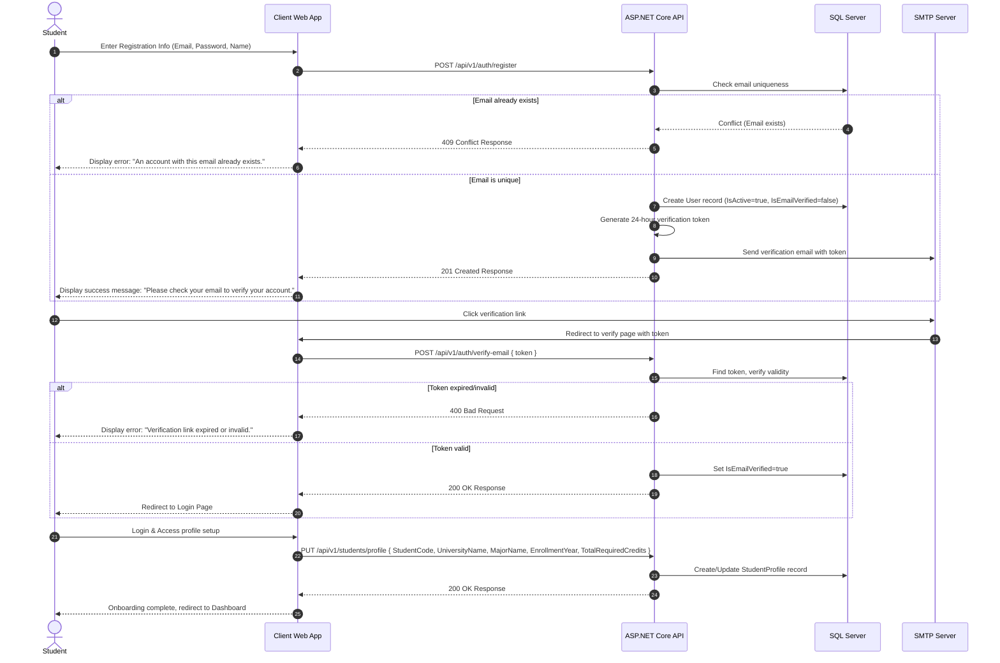
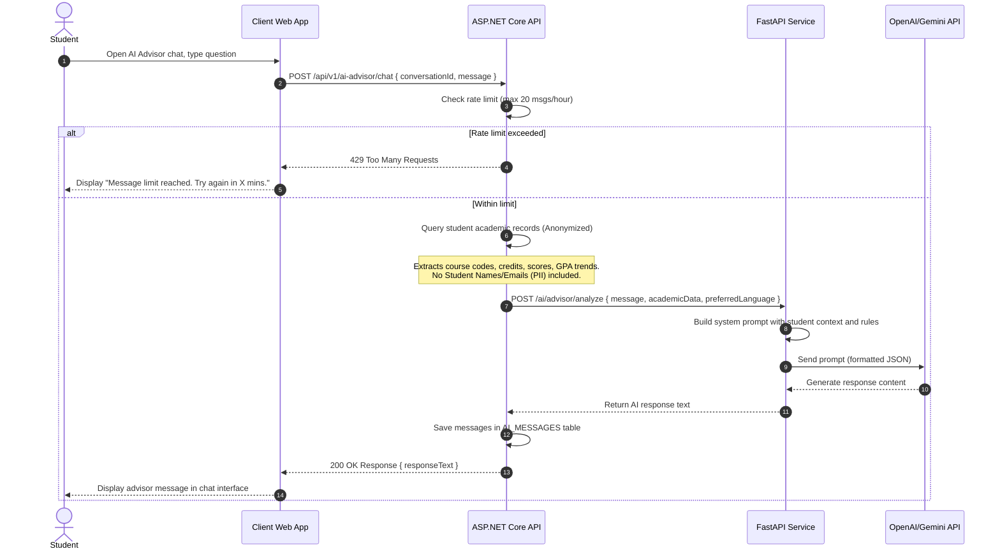
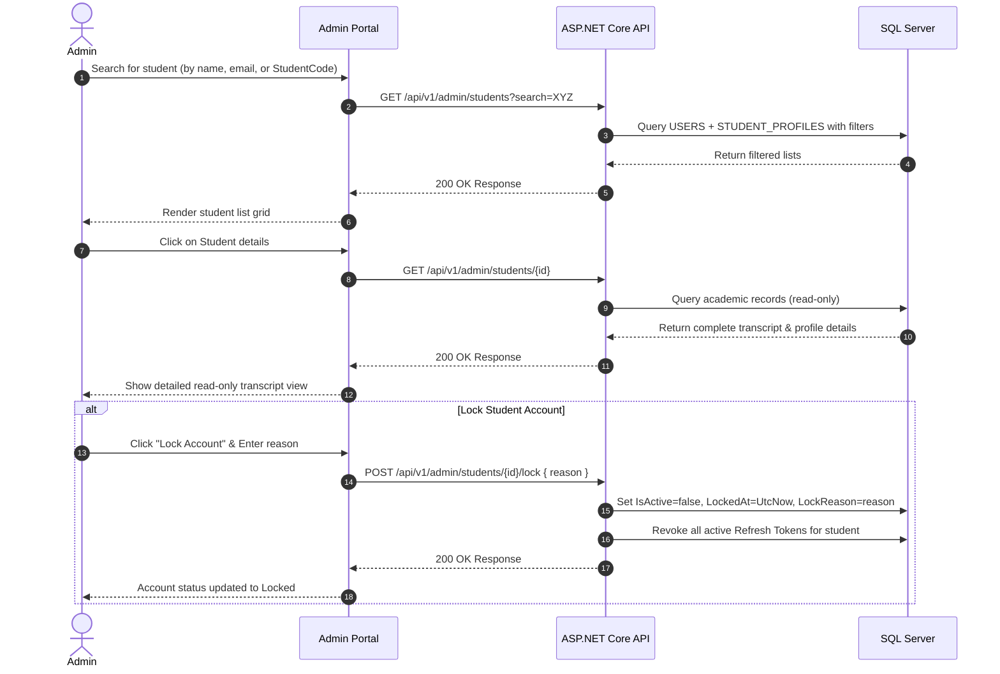

# 09 — User Flow

> **Document ID**: SRS-UF-001  
> **Version**: 1.0  
> **Last Updated**: June 2026  
> **Status**: 🔄 In Review  
> **Format**: Textual workflows and Mermaid sequence/activity diagrams

---

## 1. Document Purpose

This document outlines the end-to-end user flows for both **Student** and **Admin** actors within the Academic GPA Management System. It tracks how users navigate typical business processes, illustrating decision points, error paths, and data modifications.

---

## 2. Student Flows

### Flow SF-1: Registration, Verification, and Profile Setup
This flow details how a new student joins the platform, verifies their account, and completes their profile.



---

### Flow SF-2: Academic Record Entry & Calculation
This flow represents the typical lifecycle of entering grades and viewing recalculated GPAs.

```mermaid
activityDiagram
    start
    :User navigates to Semesters Page;
    if (Academic Year exists?) then (no)
        :Create Academic Year (e.g., "2024-2025");
        :Save Year to Database;
    endif
    if (Semester exists in selected Year?) then (no)
        :Create Semester (e.g., "Semester 1");
        :Save Semester to Database;
    endif
    :Select Semester & Click "Add Course";
    :Enter Course Code, Name, Credits (1-6);
    :Save Course;
    :Input Component Scores (Attendance, Continuous, Final Exam);
    if (All scores entered?) then (yes)
        :Apply nearest 0.5 rounding to each component;
        :Calculate Course Score: A*0.1 + C*0.3 + F*0.6;
        :Round Course Score to 1 decimal place;
        :Determine Letter Grade & GPA-4 Value;
        :Save Scores;
        :Trigger GPA Recalculation Engine;
        :Update Semester GPA (10-scale and 4-scale);
        :Update Cumulative GPA;
        :Update Academic Classification;
        :Display updated GPAs on UI;
    else (no)
        :Save partial scores;
        :Course Score and GPA remain null ("-");
        :Display scores on UI;
    endif
    stop
```

---

### Flow SF-3: Goal Planning & simulation
This flow outlines how a student sets a target GPA and uses the system to plan their goals.

1. **Setting Target Goal**:
   - The student navigates to the **Goal Planner**.
   - Input target Cumulative GPA (e.g., `8.2` on a 10-scale).
   - The API evaluates the feasibility:
     - `Current Cumulative GPA` = $C$
     - `Credits Completed` = $W_c$
     - `Target Cumulative GPA` = $T$
     - `Estimated Remaining Credits` = $W_r$
     - Required GPA for remaining credits ($R$) is calculated as:
       $$R = \frac{(T \times (W_c + W_r)) - (C \times W_c)}{W_r}$$
     - If $R > 10.0$: Warn the student that the goal is statistically impossible.
     - If $R \le 0$: Advise student that goal is already met.
     - Otherwise: Show target required semester GPA.
   - Student saves the goal.

2. **Goal Progress Auditing**:
   - Every time a course score is updated, the GPA calculation engine updates the cumulative GPA.
   - If cumulative GPA matches/exceeds target GPA, update `GpaGoal.IsAchieved = true`.
   - Dispatch system notification to the student.

---

### Flow SF-4: AI Academic Advisor Interaction
This flow details how the student communicates with the AI Advisor securely.



---

### Flow SF-5: Transcript Sharing
This flow shows the creation and consumption of shared public transcripts.

1. **Link Generation**:
   - Student clicks "Share Transcript".
   - Selects Expiry Duration (e.g., 7 days, 30 days, or Never).
   - API creates `SHARED_TRANSCRIPTS` record, generating a cryptographically secure `ShareToken` (UUID v4).
   - API returns the URL: `https://gpa.domain.com/shared/{uuid}`.
   - Student copies link and shares it.

2. **Link Verification & Viewing**:
   - Anonymous Viewer (e.g., recruiter) navigates to URL.
   - Client sends token to API: `GET /api/v1/transcripts/shared/{uuid}`.
   - API checks if link exists, is not revoked, and is not expired:
     - If invalid/expired: Return `404 Not Found` with custom error message: "This shared transcript has expired or does not exist."
     - If valid: Increment `ViewCount`, retrieve student transcript data (academic years, semesters, courses, scores, GPAs).
   - API returns anonymized transcript (name replaced with initials or student code only, based on privacy settings).
   - UI renders premium read-only transcript dashboard.

---

## 3. Admin Flows

### Flow AF-1: Student Monitoring and Account Administration
Allows system operators to inspect and lock accounts violating terms.



---

### Flow AF-2: System Broadcast Notification
Allows administrators to send announcements or policy updates.

1. **Create Broadcast**:
   - Admin navigates to Admin Notifications dashboard.
   - Enters Title (e.g., "AI System Upgrade") and Message content.
   - Selects "All Students" as target.
   - Admin clicks "Send Broadcast".
2. **Delivery & Persistence**:
   - Admin Client sends `POST /api/v1/admin/notifications/broadcast` to API.
   - API writes a record to `NOTIFICATIONS` table with `IsBroadcast = true`.
   - The notification is marked as unread for each student when they poll.
   - Next time any active Student logs in or polls (every 30s in foreground), the Client requests `GET /api/v1/notifications/unread`.
   - API includes both individual messages and active broadcast messages.
   - Client displays real-time badge count and notification toast.

---

*End of Document — User Flow*
