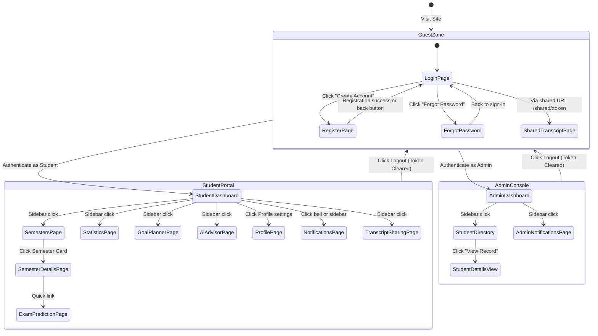

# 10 — Navigation Flow

> **Document ID**: SRS-NAV-001  
> **Version**: 1.0  
> **Last Updated**: June 2026  
> **Status**: 🔄 In Review  
> **Format**: Navigation maps, route tables, and transition matrices

---

## 1. Document Purpose

This document details the navigation architecture, site structure, and route definitions of the Academic GPA Management System. It serves as the specification for frontend routing, layout architecture, and access control validation.

---

## 2. Navigation Hierarchy (Sitemap)

The application structure is divided into three distinct navigation zones: **Public/Guest Zone**, **Student Portal**, and **Admin Console**.

```
System Navigation Map
├── [Public / Guest Zone]
│   ├── /login (Login Page)
│   ├── /register (Register Page)
│   ├── /forgot-password (Forgot Password Request)
│   ├── /reset-password (Password Reset Submission)
│   └── /shared/:token (Anonymized Shared Transcript View)
├── [Student Portal] (Requires Student Role)
│   ├── /dashboard (Academic Summary, Stats, Goals)
│   ├── /semesters (Manage Academic Years, Semesters)
│   │   └── /semesters/:id (Detailed Semester Course Grid)
│   ├── /statistics (Detailed Trend & Distribution Charts)
│   ├── /goal-planner (Target GPA Setting & Simulator)
│   ├── /exam-prediction (Reverse Calculation Score Tool)
│   ├── /ai-advisor (AI Academic Chatbot Panel)
│   ├── /profile (Account Info, Languages, Theme Settings)
│   ├── /notifications (Notification Inbox)
│   └── /transcripts (Manage & Create Share Links)
└── [Admin Console] (Requires Admin Role)
    ├── /admin/dashboard (System-wide Stats, Logins, average GPAs)
    ├── /admin/students (Search, View Profile, Lock/Unlock, Temp Password)
    └── /admin/notifications (Create Individual/Broadcast System Messages)
```

---

## 3. Application Routing Table

All routes are client-side routed (Single Page Application via React Router) and enforced via backend middleware.

| Route Path | Layout Template | Auth Required? | Allowed Roles | Description |
|------------|-----------------|----------------|---------------|-------------|
| `/login` | GuestLayout | No | Guest | Sign-in portal (Email & Google Auth) |
| `/register` | GuestLayout | No | Guest | Student sign-up page |
| `/forgot-password` | GuestLayout | No | Guest | Reset password email request screen |
| `/reset-password` | GuestLayout | No | Guest | Password update with reset token |
| `/shared/:token` | GuestLayout | No | Guest / Public | Anonymized view of student transcripts |
| `/dashboard` | StudentLayout | Yes | Student | Overview dashboard (cards & charts) |
| `/semesters` | StudentLayout | Yes | Student | View and add academic years and semesters |
| `/semesters/:id` | StudentLayout | Yes | Student | Course table, grades input, calculations |
| `/statistics` | StudentLayout | Yes | Student | Visualized GPA trends and achievements |
| `/goal-planner` | StudentLayout | Yes | Student | Target setting & "What-If" simulator |
| `/exam-prediction`| StudentLayout | Yes | Student | Inverse grade calculator |
| `/ai-advisor` | StudentLayout | Yes | Student | Real-time chat with LLM Advisor |
| `/profile` | StudentLayout | Yes | Student | Edit info, preferences (VI/EN, Theme) |
| `/notifications` | StudentLayout | Yes | Student | History of system/admin messages |
| `/transcripts` | StudentLayout | Yes | Student | Share link management |
| `/admin/dashboard` | AdminLayout | Yes | Admin | System telemetry and student counts |
| `/admin/students` | AdminLayout | Yes | Admin | Searchable data grid of student records |
| `/admin/notifications`| AdminLayout | Yes | Admin | Broadcast creation panel |

---

## 4. UI Layout & Component Navigation

### 4.1 Guest Layout (Non-Authenticated)
- **Top Bar**: Minimalist header with Product Logo and Language Switcher (VI/EN).
- **Container**: Card-based interface centered on the screen for login, sign-up, or token checking.

### 4.2 Student Layout (Authenticated)
- **Persistent Left Sidebar**:
  - Top: Logo + Brand Name.
  - Middle (Nav links): Dashboard, Semesters & Courses, Statistics, Goal Planner, Exam Prediction, AI Advisor, Share Transcripts.
  - Bottom: User Avatar, Name, and Logout action button.
- **Top Header**:
  - Collapse Sidebar button.
  - Language Switcher (VI/EN flag toggles).
  - Theme Switcher (Sun/Moon icons).
  - Notification Bell Icon (displays real-time unread badge count, triggers dropdown list of 5 recent messages, with a link to "View All").
- **Content Area**: Dynamic routing area with responsive grids.

### 4.3 Admin Layout (Authenticated)
- **Persistent Left Sidebar**:
  - Top: Logo + "Admin Console" label.
  - Middle: System Dashboard, Student Directory, Notifications Manager.
  - Bottom: Admin Name, Logout action.
- **Top Header**: Same as Student layout, excluding notifications bell (or replacing it with system alerts).

---

## 5. Navigation State Transitions

The state transition diagram below describes how authentication status controls page access.



---

## 6. Access Control and Route Guarantees (Guards)

1. **Anonymous Guard (`GuestRoute`)**:
   - Enforced on: `/login`, `/register`, `/forgot-password`, `/reset-password`.
   - If user token exists and is valid: Redirect to `/dashboard` (for students) or `/admin/dashboard` (for admins).
2. **Authenticated Guard (`ProtectedRoute`)**:
   - Enforced on: all routes within `/dashboard` onward.
   - If no token exists: Redirect to `/login` with `returnUrl` query parameter.
3. **Role Guard (`RoleRoute`)**:
   - Enforced on: `/admin/*` and student portal routes.
   - If role does not match: Redirect to `403 Forbidden` error screen or fall back to dashboard.

---

*End of Document — Navigation Flow*
