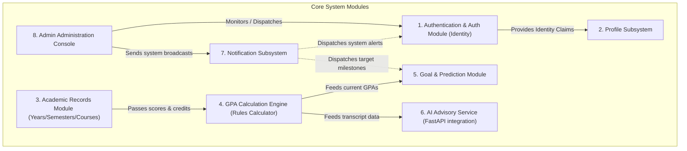

# 11 — System Modules

> **Document ID**: SRS-MOD-001  
> **Version**: 1.0  
> **Last Updated**: June 2026  
> **Status**: 🔄 In Review  
> **Format**: Subsystem maps, component definitions, and module interfaces

---

## 1. Document Purpose

This document provides a modular decomposition of the Academic GPA Management System. It defines the structural boundaries, responsibilities, component breakdowns, and communication channels for both backend APIs and the frontend Single Page Application (SPA).

---

## 2. High-Level Modular Architecture

The system is decomposed into 8 main logical modules. The ASP.NET Core API provides modular endpoints, while the React client features lazy-loaded modules map-to-map with these structures.

---

## 3. Detailed Module Breakdown

### Module 1: Authentication & Authorization (AuthModule)
Manages user onboarding, token issuance, active sessions, and access security checks.
*   **Key Responsibilities**:
    *   Secure student registration and email verification.
    *   Standard login and Google OAuth 2.0 integration.
    *   JSON Web Token (JWT) issuance and token family rotation.
    *   Password recovery triggers.
*   **Data Models Involved**: `User`, `RefreshToken`
*   **Key Interfaces (C#)**:
    *   `IAuthService`: Handles register/login/OAuth calls.
    *   `IJwtService`: Generates and rotates tokens.
*   **Security Controls**: BCrypt hashing, JWT validation middleware, Google OAuth signature validation.

### Module 2: Profile Subsystem (ProfileModule)
Manages personal student identifiers, enrollment details, and user interface customization.
*   **Key Responsibilities**:
    *   Store student academic attributes (Code, Major, University, required credits).
    *   Manage user preferences (Theme: Dark/Light, Language: VI/EN).
    *   Manage avatars.
*   **Data Models Involved**: `StudentProfile`
*   **Key Interfaces (C#)**:
    *   `IProfileService`: Updates preferences, processes profile fields.

### Module 3: Academic Records Module (AcadRecordModule)
Maintains the hierarchical data structures containing academic years, semesters, and courses.
*   **Key Responsibilities**:
    *   Manage Year metadata (Start Year, End Year, sorting).
    *   Manage Semesters per Year (max 3 semesters/year restriction check).
    *   Manage Courses per Semester (Credits: 1-6, retake markers).
    *   Manage Course score component arrays (Attendance, Continuous, Final Exam).
*   **Data Models Involved**: `AcademicYear`, `Semester`, `Course`, `Score`, `ScoreAuditLog`
*   **Key Interfaces (C#)**:
    *   `IAcademicRepository`: Direct DB commands for years and semesters.
    *   `ICourseService`: Manages retake reference linking logic.

### Module 4: GPA Calculation Engine (GpaEngineModule) ⭐ CRITICAL
The domain engine that handles all score rounding, letter conversions, and GPA weighting calculations.
*   **Key Responsibilities**:
    *   Apply BR-CALC rounding rules (nearest 0.5 for components, 1-decimal for course scores).
    *   Map score to Letter Grade (A+ to F) and GPA-4 equivalent (4.0 to 0.0).
    *   Aggregate Semester GPA (10-scale and 4-scale) weighted by course credits.
    *   Calculate Cumulative GPA, resolving retaken courses (highest attempt counts).
    *   Establish Academic Classifications (Excellent, Good, Average, etc.).
*   **Data Models Involved**: `Score`, `Course`, `Semester` (Read-only for calculation)
*   **Key Interfaces (C#)**:
    *   `IGpaCalculator`: Core calculation service.
    *   `GradeResult` (Value Object): Encapsulates conversion tables.
*   **Enforcement**: Triggered on DB save changes for scoring components. Fully transaction-safe.

### Module 5: Goal & Prediction Module (GoalPredictModule)
Provides statistical simulation and forecasting functions.
*   **Key Responsibilities**:
    *   Manage target Cumulative GPA setting.
    *   Run back-calculations to forecast required GPA for remaining semesters.
    *   Predict required Final Exam score based on attendance and continuous scores.
    *   Simulate "what-if" situations without altering actual grade records.
*   **Data Models Involved**: `GpaGoal`
*   **Key Interfaces (C#)**:
    *   `IGoalPlannerService`: Feasibility assessments.
    *   `IPredictionEngine`: Reverse-calculates scoring thresholds.

### Module 6: AI Advisory Module (AiAdvisorModule)
Bridges the academic database with the Generative AI microservice.
*   **Key Responsibilities**:
    *   Maintain conversational chat history per student (up to 50 active chats, soft deletes).
    *   Anonymize student PII before external transmission.
    *   Forward contextual student performance arrays to the FastAPI python microservice.
    *   Enforce LLM rate-limiting rules (max 20 messages/hour).
*   **Data Models Involved**: `AiConversation`, `AiMessage`
*   **Key Interfaces (C# / Python)**:
    *   `IAiAdvisorService` (C#): Handles conversation history and FastAPI requests.
    *   `LLMService` (Python/FastAPI): Formulates Prompts and calls OpenAI/Gemini.

### Module 7: Notification System (NotifModule)
Manages direct student messages, alert triggers, and broad system announcements.
*   **Key Responsibilities**:
    *   Persist alert items (Title, Message, Read Status).
    *   Deliver system-triggered alerts (e.g., "GPA Target Achieved").
    *   Expose unread queues for periodic polling requests (every 30s).
    *   Automate retention cleanups (purge read history after 1 year).
*   **Data Models Involved**: `Notification`
*   **Key Interfaces (C#)**:
    *   `INotificationService`: Dispatches alerts, clears read lists.

### Module 8: Admin Console Module (AdminModule)
Enables system managers to oversee user accounts and overall application usage metrics.
*   **Key Responsibilities**:
    *   Telemetry views (total user counts, active statistics).
    *   Search and edit student accounts (lock/unlock active statuses).
    *   Dispatch broadcast notices to all active users.
    *   Manage temporary credentials for locked-out students.
*   **Data Models Involved**: All models (Read-only access for student data, write access to account fields)
*   **Key Interfaces (C#)**:
    *   `IAdminService`: Operations for user status locks and broadcasts.

---

## 4. Module Interface Boundaries

The table below indicates the protocols and schemas defining communications between modules.

| Source Module | Target Module | Protocol / Method | Data Exchanged |
|---|---|---|---|
| **AcadRecordModule** | **GpaEngineModule** | Direct Service Injection | Course details, raw component scores |
| **GpaEngineModule** | **GoalPredictModule** | Event Trigger | Updated Cumulative GPA, Completed Credits count |
| **GpaEngineModule** | **AiAdvisorModule** | Internal DTO mapping | Anonymized grade trends and classification tiers |
| **GoalPredictModule**| **NotifModule** | Mediator / In-app event | Notification body ("Target Achieved") |
| **AdminModule** | **NotifModule** | Entity Persistence | Broadcast message body, target recipient list |
| **AuthModule** | **AdminModule** | DB Query | User identity audit logs, login timestamps |
| **ASP.NET Core Web API** | **FastAPI AI Service** | HTTP POST (JSON REST) | Anonymized performance context + user query |

---

## 5. Technology Matrix by Subsystem

*   **API Layer (Backend)**: ASP.NET Core Web API (.NET 8), Entity Framework Core 8, MediatR (for decoupling command and query processing), FluentValidation.
*   **AI Microservice**: Python 3.11, FastAPI, Pydantic, HTTPX, Google Generative AI / OpenAI library.
*   **Client App (Frontend)**: React 18, Vite, TypeScript, TailwindCSS, Chart.js / Recharts (for statistics rendering).
*   **Storage & Caching**: SQL Server 2022 (Primary relational DB), IMemoryCache (Application caching).

---

*End of Document — System Modules*
