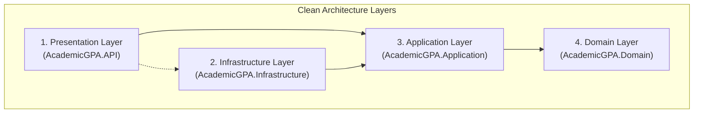
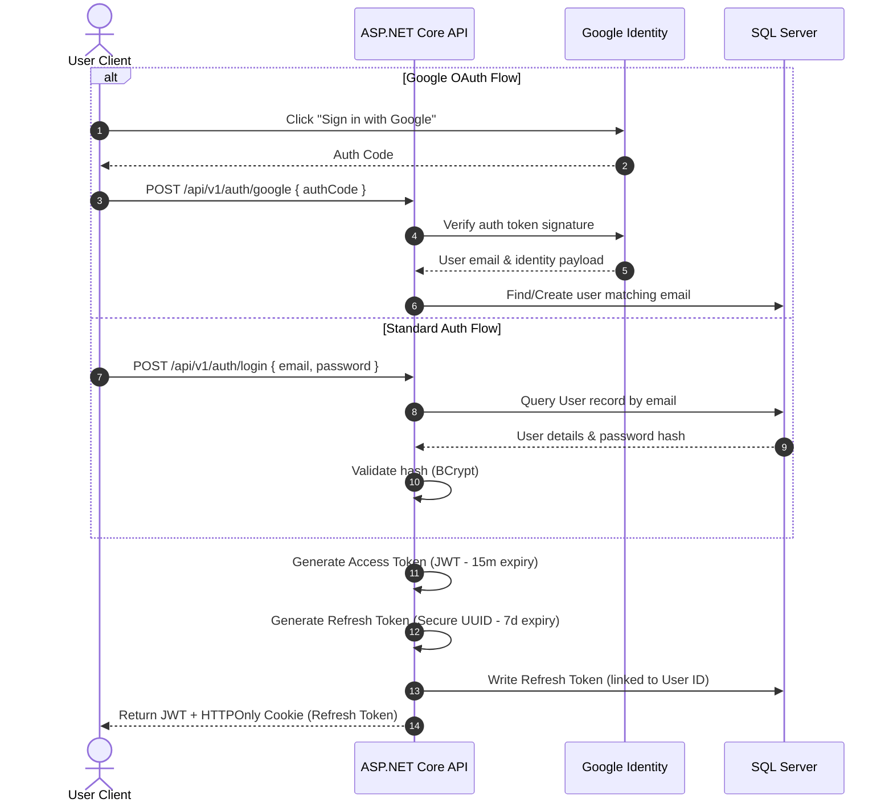

# 01 — Overall Architecture

> **Document ID**: ARC-OA-001  
> **Version**: 1.0  
> **Last Updated**: June 2026  
> **Status**: 🔄 In Review  
> **Format**: Architecture specifications and Mermaid structural maps

---

## 1. System Overview

The Academic GPA Management System is designed as a modern, decoupled, multi-tier web platform. The platform separates client presentation, core business logic, data persistence, and specialized AI advisory functions into distinct tiers. This decoupling guarantees independent scalability, technical isolation, and clean team boundaries.

---

## 2. High-Level Client-Server Architecture

The system operates on a client-server model over HTTPS. The frontend Single Page Application (SPA) acts as the client, interacting with two discrete servers: the primary ASP.NET Core REST API gateway and a specialized Python FastAPI AI service.

```mermaid
graph TB
    subgraph "Client Tier"
        SPA["React Web App (SPA)<br/>Vite + TypeScript + TailwindCSS"]
    end

    subgraph "API Routing & Gateway Tier"
        NGINX["Nginx Web Server / Reverse Proxy"]
    end

    subgraph "Application Logic Tier"
        API["ASP.NET Core Web API<br/>.NET 9 (C#)"]
        AI["FastAPI Microservice<br/>Python 3.11"]
    end

    subgraph "Data Tier"
        DB[("Microsoft SQL Server 2022<br/>Relational Database")]
        CACHE["In-Memory Cache<br/>IMemoryCache / Redis"]
    end

    subgraph "External Providers"
        GOOGLE["Google Identity Platform<br/>(OAuth 2.0)"]
        SMTP["SMTP Server<br/>(Transactional Email)"]
        LLM["Generative AI LLM Providers<br/>(Gemini / OpenAI API)"]
    end

    %% Network interactions
    SPA -->|HTTPS (JSON)| NGINX
    NGINX -->|/api/v1/*| API
    NGINX -->|/ai/*| AI
    
    API -->|Entity Framework Core 9| DB
    API -->|Cache Requests| CACHE
    API -->|OAuth Verification| GOOGLE
    API -->|Email Dispatch| SMTP
    API -->|HTTP REST| AI
    
    AI -->|Anonymized Prompts| LLM
```

---

## 3. Clean Architecture Implementation

The core ASP.NET Core API strictly enforces **Clean Architecture** (Onion Architecture) principles. High-level policies reside in the core, while low-level details (database, third-party libraries, UI presentation) are kept at the outer edges. Dependency directions point inward toward the core domain.



### Layer Responsibilities

1.  **Domain Layer (AcademicGPA.Domain)**:
    *   The absolute core of the application. Contains zero external dependencies.
    *   Defines core domain models (`Student`, `Course`, `Score`), custom value objects (`GradeResult`), and core domain exceptions.
    *   Implements pure business validation and computation logic (e.g. course score calculation formulas, letter grade conversion tables).
2.  **Application Layer (AcademicGPA.Application)**:
    *   Orchestrates application use cases, defining what actions the system can perform.
    *   Defines Data Transfer Objects (DTOs), Command/Query handlers (using the Mediator pattern), FluentValidation rules, and mapping profiles.
    *   Defines abstract interfaces for outer-layer operations (e.g. `IAiAdvisorService`, `IEmailService`, `IApplicationDbContext`).
3.  **Infrastructure Layer (AcademicGPA.Infrastructure)**:
    *   Implements the abstractions defined in the Application layer.
    *   Contains the Entity Framework Core DB Context, concrete SQL repositories, JWT token generation logic, Google OAuth verification, and SMTP mail dispatch client.
4.  **Presentation Layer (AcademicGPA.API)**:
    *   The entry point of HTTP traffic.
    *   Contains ASP.NET Core Web Controllers, custom Middlewares (exception handling, security headers, rate limiting), and OpenAPI/Swagger configurations.

---

## 4. AI Service Integration

To keep the primary backend lightweight and utilize Python's extensive machine learning ecosystem, all goal planning and LLM integration tasks are delegated to a dedicated **Python FastAPI service**.

*   **Communication Protocol**: The ASP.NET Core backend communicates with the FastAPI service via internal HTTP REST payloads over private virtual networks (or Docker-internal DNS).
*   **Privacy Isolation**: The primary C# API acts as a gateway proxy. It fetches the raw academic scores, strips out all Personal Identifying Information (PII) like names or student codes, maps the dataset to an anonymized context DTO, and dispatches it to FastAPI. FastAPI is responsible for combining this context with system prompts and managing OpenAI/Gemini endpoints.

---

## 5. End-to-End Authentication & Authorization Flow

The system employs stateless JWT-based authentication combined with a robust Refresh Token Rotation (RTR) mechanism and Google OAuth 2.0 for external identity federation.



---

*End of Document — Overall Architecture*
