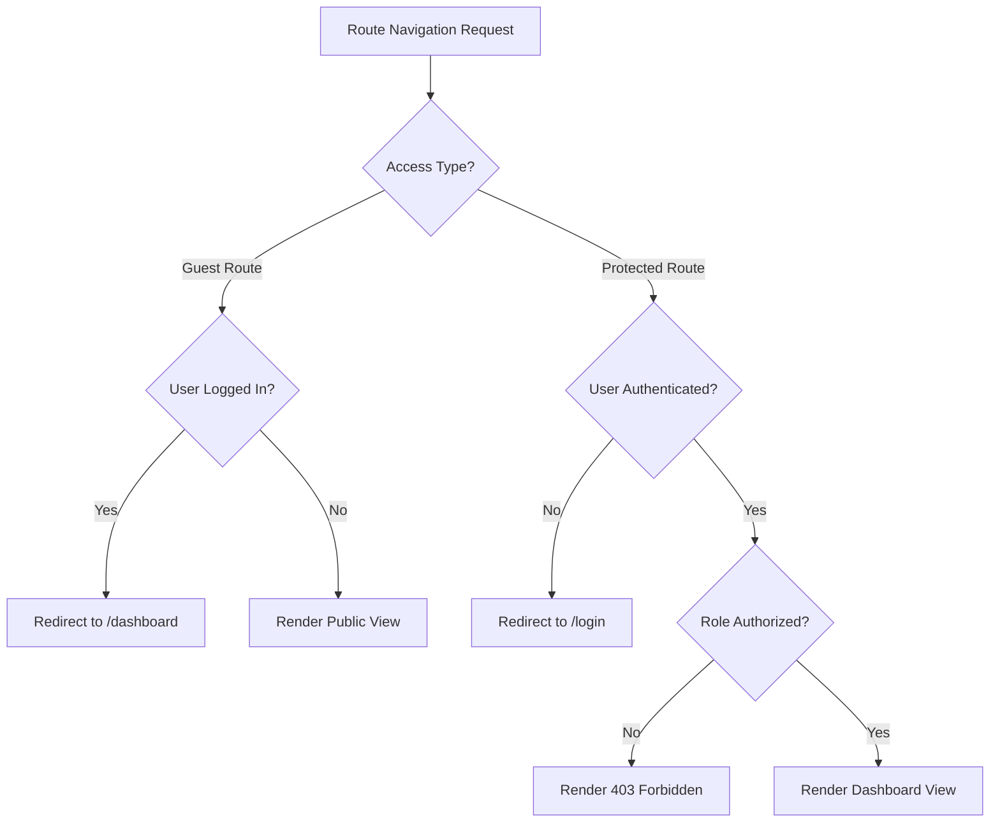

# 05 — Frontend Architecture

> **Document ID**: ARC-FE-001  
> **Version**: 1.0  
> **Last Updated**: June 2026  
> **Status**: 🔄 In Review  
> **Format**: React / TypeScript Single Page Application (SPA) structural patterns

---

## 1. Client Architecture Overview

The client-side application is built as a highly responsive Single Page Application (SPA) using **React 18**, **TypeScript**, and **TailwindCSS**, bundled with **Vite**. The frontend maintains separation of concerns, decoupling UI components from network layers, state orchestration, and localization.

---

## 2. Directory Component Design

### 2.1 UI Layout Templates
The application defines three structural layouts to wrap routed views:
1.  **GuestLayout**: Clean, centered card wrapper for authentication actions (Login, Registration, Forgot Password) and public views (Shared Transcript).
2.  **StudentLayout**: Persistent sidebar navigation drawer, dashboard top header (containing Theme Toggle, Language Switcher, and Notification Bell), and a main scrollable content canvas.
3.  **AdminLayout**: Sidebar optimized for system monitoring and student administration grids.

### 2.2 Component Hierarchy
Components adhere to a modular, reusable design system:
*   **Common / Atomic Core**: Stateless atomic widgets (`Button.tsx`, `Input.tsx`, `Modal.tsx`, `Card.tsx`) styled using utility patterns.
*   **Feature Modules**: Dynamic layout blocks tied to specific modules (e.g. `WhatIfSimulator.tsx` inside `/components/goal-planner`).

---

## 3. Core Architectural Modules

### 3.1 Network API Layer (Axios Interceptors)
*   **Behavior**: Centralized Axios client instance config (`/api/axiosInstance.ts`).
*   **Actions**:
    *   **Authorization Header**: Injects the active JWT Access Token in the header of each request.
    *   **Automatic Refresh Interceptor**: If an API call returns `401 Unauthorized`, the interceptor queues the original request, attempts to refresh the access token via `/api/v1/auth/refresh-token`, updates the local token store, and re-dispatches the queued request.
    *   **Error Parser**: Standardizes API exceptions into client-friendly error structures.

### 3.2 State Management (React Context)
*   **Behavior**: Lightweight context wrappers manage global application states:
    *   `AuthContext`: Stores user profiles, authentication state, and token lifecycles.
    *   `ThemeContext`: Tracks and updates the Light/Dark mode state.
    *   `LanguageContext`: Dictates active translation configurations (VI/EN).

### 3.3 Routing & Route Guards (React Router)
*   **Behavior**: Enforces route access using route guards:
    *   `PublicRoute`: Blocks authenticated users from reaching `/login` or `/register` (redirects to `/dashboard`).
    *   `ProtectedRoute`: Directs non-authenticated guests to `/login`.
    *   `RoleRoute`: Restricts admin paths (`/admin/*`) to accounts with the Admin claim.

### 3.4 Form Management & Validation
*   **Behavior**: Handled via **React Hook Form** paired with **Zod** schema validations.
*   **Implementation**: Form fields map directly to Zod schema constraints. Client-side errors are caught and highlighted in real-time, preventing invalid API calls.

### 3.5 Themes & Styling (TailwindCSS)
*   **Behavior**: Supports Light and Dark modes.
*   **Actions**: Theme state is persisted in `localStorage`. Toggling modes adds or removes the `.dark` class from the `html` document root. Responsive breakpoints (Mobile: `<640px`, Tablet: `640px-1024px`, Desktop: `>1024px`) are built using Tailwind utilities.

### 3.6 Internationalization (i18n)
*   **Behavior**: Powered by **i18next** and `react-i18next`.
*   **Actions**: Translation strings are stored in static JSON assets (`/public/locales/{en|vi}/translation.json`). Language preferences are saved to user profile settings and loaded during login.

---

## 4. Custom React Hooks Specification

1.  `useAuth()`: Provides quick access to AuthContext properties (`user`, `login()`, `logout()`, `isAuthenticated`).
2.  `useGpa()`: Coordinates academic calculations, exposing functions to pull records, post new grades, and trigger UI updates.
3.  `useTheme()`: Toggles the Light/Dark mode classes and persists theme state.
4.  `useDebounce()`: Throttles search inputs (e.g. typing in the admin student grid) before dispatching API requests.

---

*End of Document — Frontend Architecture*
