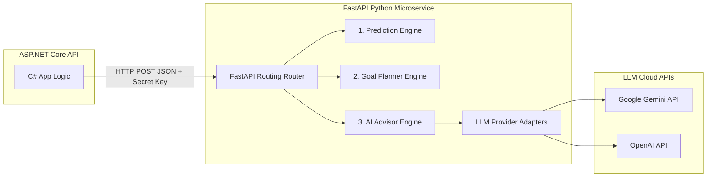

# 09 — AI Service Architecture

> **Document ID**: ARC-AI-001  
> **Version**: 1.0  
> **Last Updated**: June 2026  
> **Status**: 🔄 In Review  
> **Format**: Python FastAPI microservice architecture and integration contracts

---

## 1. AI Service Overview

The AI Service is a dedicated Python microservice built with **FastAPI**. It isolates generative AI dependencies and mathematical forecasting algorithms from the primary C# web API. The service handles predictions, goal planning computations, and conversational academic advisory tasks.



---

## 2. Core Engines Design

### 2.1 Prediction Engine
*   **Behavior**: Reverse-calculates required grades for final exams.
*   **Algorithm**:
    *   To earn a target grade $T$, the required overall course score is $S$.
    *   The student's rounded Attendance score is $A$, and their rounded Continuous Assessment score is $C$.
    *   The required Final Exam score $F$ is calculated as:
        $$F = \frac{S - (A \times 0.1) - (C \times 0.3)}{0.6}$$
    *   **Feasibility Check**:
        *   If $F > 10.0$: Returns "Goal is not achievable."
        *   If $F \le 0.0$: Returns "Goal is already achieved."
        *   Otherwise: Returns $F$ rounded to the nearest $0.5$.

### 2.2 Goal Planner
*   **Behavior**: Evaluates if a student's target Cumulative GPA is realistic.
*   **Algorithm**:
    *   Let $W_c$ be completed credits, $C$ be current cumulative GPA, $T$ be target cumulative GPA, and $W_r$ be estimated remaining credits.
    *   The average GPA $R$ required across remaining credits is calculated as:
        $$R = \frac{(T \times (W_c + W_r)) - (C \times W_c)}{W_r}$$
    *   **Feasibility Check**: If $R > 10.0$ (or $R > 4.0$ on a 4-scale), the goal is marked as impossible. The engine then suggests alternative realistic targets.

### 2.3 AI Advisor
*   **Behavior**: Provides personalized study advice based on academic history.
*   **Prompt Construction**: FastAPI constructs a system prompt by merging the student's anonymized course records and GPA trends with standard advising guidelines. This prompt is sent to the LLM along with the chat history.
*   **LLM Configuration**: The service uses a temperature of `0.3` to ensure responses remain consistent, objective, and focused on study strategies.

---

## 3. Communication Protocols & Security

*   **Internal Network Communication**: The ASP.NET Core API and the Python FastAPI service communicate over a private network (e.g. Docker network DNS) via HTTP REST.
*   **API Secret Verification**: Requests to FastAPI must include a shared secret key in the `X-API-Key` HTTP header. The FastAPI middleware rejects unauthorized requests with a `401 Unauthorized` response.
*   **Data Anonymization**: The ASP.NET Core API strips all personal identifiers (names, emails, student IDs) from request payloads before sending them to the AI service.

---

## 4. API Contracts

### 4.1 AI Advisor Endpoint (`POST /ai/advisor/chat`)

#### Request Payload
```json
{
  "message": "How can I improve my GPA to reach 8.0?",
  "preferredLanguage": "vi",
  "academicContext": {
    "currentCumulativeGpa": 7.42,
    "totalCreditsCompleted": 45,
    "totalCreditsRequired": 120,
    "gpaTrend": [
      { "semesterName": "Semester 1", "gpa": 7.1 },
      { "semesterName": "Semester 2", "gpa": 7.6 }
    ],
    "weakCourses": [
      { "courseCode": "MATH101", "courseName": "Calculus 1", "score": 5.5 }
    ]
  },
  "chatHistory": [
    { "role": "user", "content": "Hello AI" },
    { "role": "assistant", "content": "Hello! I am your AI academic advisor. How can I help you today?" }
  ]
}
```

#### Response Payload
```json
{
  "response": "Dựa trên kết quả học tập của bạn, để đạt mục tiêu GPA 8.0, bạn nên cải thiện các môn toán...",
  "tokensUsed": 340,
  "provider": "Gemini-1.5-Flash"
}
```

---

### 4.2 Prediction Endpoint (`POST /ai/predict/final-score`)

#### Request Payload
```json
{
  "attendanceScore": 8.0,
  "continuousScore": 7.5,
  "targetGrade": "B+"
}
```

#### Response Payload
```json
{
  "targetScoreThreshold": 8.0,
  "requiredFinalExamScore": 8.5,
  "feasibility": "Achievable",
  "advice": "You need to score at least 8.5 on the Final Exam to secure a B+."
}
```

---

*End of Document — AI Service Architecture*
