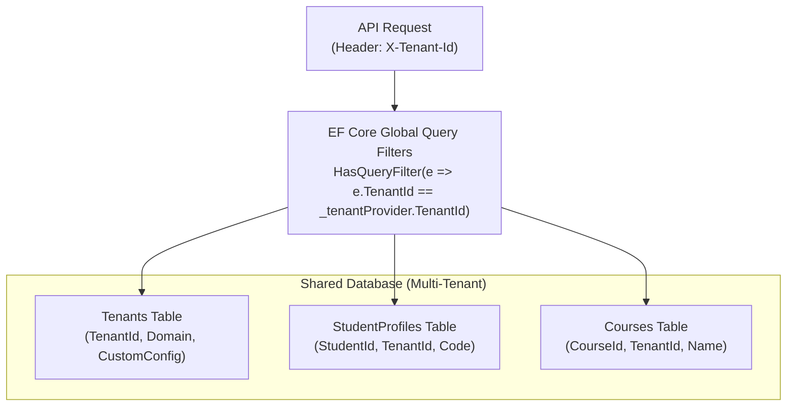

# 14 — Future Scalability

> **Document ID**: ARC-SCAL-001  
> **Version**: 1.0  
> **Last Updated**: June 2026  
> **Status**: 🔄 In Review  
> **Format**: Scalability guidelines and multi-tenant expansion designs

---

## 1. Document Purpose

This document outlines the architectural patterns and design choices implemented in Phase 2 to ensure the Academic GPA Management System can scale to support multiple universities, custom grading scales, native mobile applications, and high-availability cloud deployments.

---

## 2. Multi-Tenant Architecture (Multiple Universities)

To support hosting the platform for multiple universities, the architecture is designed to support a **Logical Multi-Tenancy** model:

### 2.1 Tenant Identification
*   **Header-Based**: The API identifies the tenant via the `X-Tenant-ID` HTTP header or from the authenticated user's JWT claim (`tenant_id`).
*   **Query Filtering**: Entity Framework Core enforces global query filters on all tenant-specific entities, ensuring users can only access data belonging to their university.

### 2.2 Custom Configuration
*   Each tenant configuration defines custom styling parameters (logo, primary theme colors), allowed credit ranges, and active grading scales.

---

## 3. Dynamic Grading Systems

To support universities with different grading scales (e.g. 100-point scales, 5.0 GPA scales, ECTS credits):
*   **Database-Driven Config**: Grading conversion logic is moved from hardcoded C# classes to database-driven configuration tables (`GradingScales` and `GradeThresholds`).
*   **Engine Decoupling**: The `GpaCalculatorService` reads the student's tenant configuration at runtime to apply the correct grading rules, keeping the core calculation engine flexible and reusable.

---

## 4. Mobile API Compatibility

To support native iOS and Android applications in the future:
*   **API Versioning**: Enforces strict URL-based versioning (`/api/v1/`) to ensure mobile updates do not break backward compatibility.
*   **Payload Optimization**: Endpoints return flat, lightweight JSON payloads, avoiding deep nesting to minimize mobile data consumption.
*   **Token Rotation Stability**: The RTR mechanism includes a 10-second clock skew window to handle minor network drops during token refreshes on mobile devices.

---

## 5. Cloud Deployment & Microservice Transition

### 5.1 Containerization & Orchestration
*   All components (React static site, ASP.NET API, FastAPI service) are packaged into independent Docker containers.
*   The system is ready for **Kubernetes** deployment, using horizontal pod autoscaling (HPA) to handle traffic spikes.

### 5.2 Microservice Extraction
If the application experiences high traffic, the architecture allows components to be extracted into independent microservices:
1.  **Identity Service**: Extract the authentication module into a dedicated OAuth 2.0 / OpenID Connect Identity Provider.
2.  **AI Advisor Service**: The FastAPI service can scale independently to handle heavy LLM processing without impacting standard API response times.

---

*End of Document — Future Scalability*
