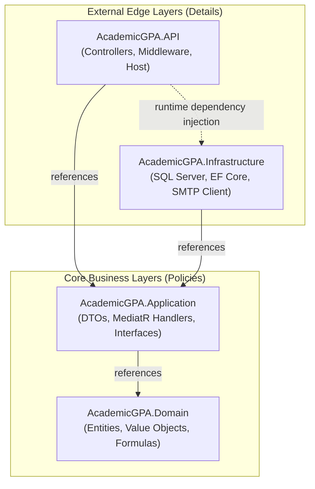

# 02 — Clean Architecture Blueprint

> **Document ID**: ARC-BE-CLEAN-001  
> **Version**: 1.0  
> **Last Updated**: June 2026  
> **Status**: 🔄 In Review  
> **Format**: Clean Architecture reference rules and namespace boundaries

---

## 1. Clean Architecture Principles

The backend is built on **Clean Architecture** patterns. The core domain layer (which contains the business entities and calculation rules) is decoupled from databases, UI frameworks, and third-party libraries.

---

## 2. Dependency Flow Map

All dependencies flow inward towards the Domain Core:

---

## 3. Layer Separation Specifications

### 3.1 Domain Layer (AcademicGPA.Domain)
*   **Role**: Contains the business state and calculation models.
*   **Boundary Rule**: Must not import namespaces from other projects or reference third-party libraries (except for core language components like System).

### 3.2 Application Layer (AcademicGPA.Application)
*   **Role**: Orchestrates use cases (commands and queries).
*   **Boundary Rule**: Defines abstract interfaces for external actions (e.g. `IEmailService`, `IApplicationDbContext`). It does not implement them.

### 3.3 Infrastructure Layer (AcademicGPA.Infrastructure)
*   **Role**: Implements interfaces defined in the Application layer, connecting the system to database engines and external providers.
*   **Boundary Rule**: Translates database exceptions into domain exceptions before bubbles them up to the API controllers.

### 3.4 Presentation Layer (AcademicGPA.API)
*   **Role**: Handles HTTP requests, maps routes to controllers, and parses JWT access tokens.
*   **Boundary Rule**: Controllers must contain zero business logic. They simply pass requests to MediatR handlers.

---

*End of Document — Clean Architecture Blueprint*
