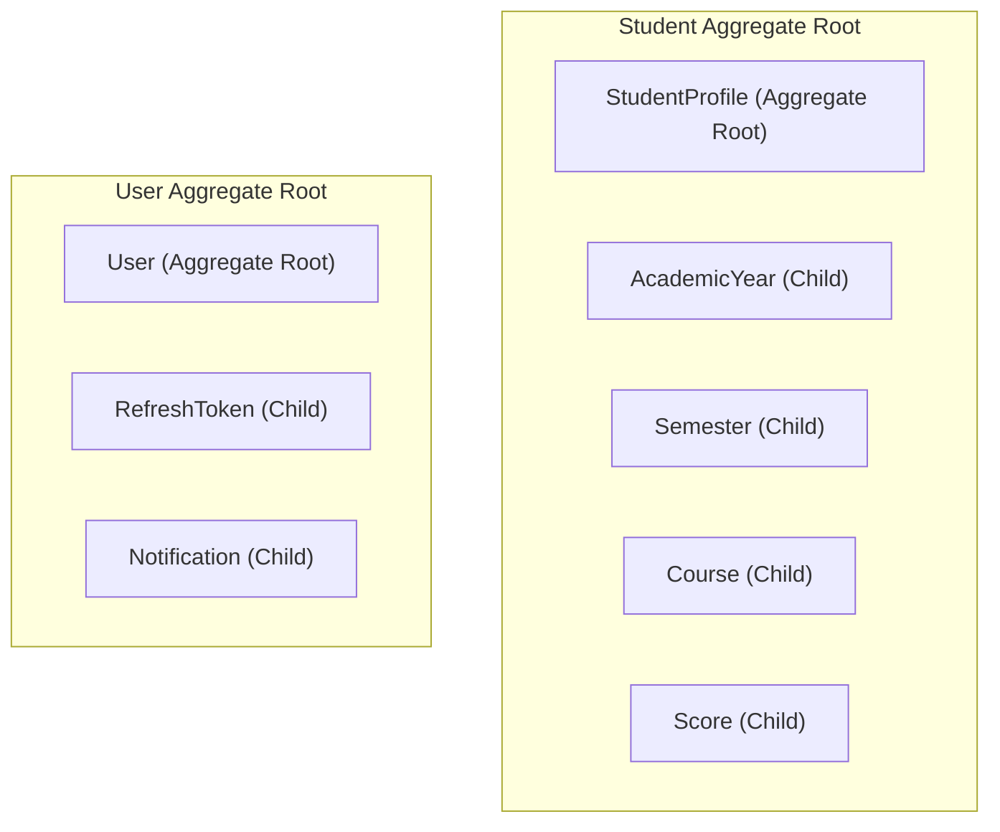

# 03 — Domain Layer Design

> **Document ID**: ARC-BE-DOM-001  
> **Version**: 1.0  
> **Last Updated**: June 2026  
> **Status**: 🔄 In Review  
> **Format**: Domain Entities, Value Objects, and Aggregate models

---

## 1. Document Purpose

This document details the classes, aggregates, value objects, and exception rules within the `AcademicGPA.Domain` layer.

---

## 2. Aggregates & Boundaries

To protect data consistency, domain models are grouped into logical boundary units:

### 2.1 The Student Profile Aggregate
*   **Aggregate Root**: `StudentProfile`
*   **Child Entities**: `AcademicYear`, `Semester`, `Course`, `Score`
*   **Access Control**: All operations modifying academic records (e.g. adding a course, updating a grade) must load the parent `StudentProfile` root first, ensuring that modifications validation constraints across the entire academic history (such as credit caps and course retake calculations) are checked.

---

## 3. Core Domain Classes

### 3.1 Domain Entities
*   **User**: Handles account identity. Holds `Email`, `PasswordHash`, `Role`, `IsActive`, and interface preferences.
*   **StudentProfile**: Represents the student identity. Holds `StudentCode` (MSSV), `UniversityName`, and `MajorName`.
*   **AcademicYear**: Represents a year container. Holds `YearName`, `StartYear`, and `EndYear`.
*   **Semester**: Holds `SemesterName` and displays list sequence indexes.
*   **Course**: Holds `CourseCode`, `CourseName`, and `Credits`. Points to an `OriginalCourseId` if flagged as a retake.
*   **Score**: Holds component values (`AttendanceScore`, `ContinuousScore`, `FinalExamScore`) and calculation outputs (`CourseScore`, `LetterGrade`, `Gpa4Value`).
*   **RefreshToken**: Tracks user sessions, rotation keys, and IP logs.
*   **GpaGoal**: Tracks active target GPAs and achievements.
*   **SharedTranscript**: Governs public UUID share links and view counts.

---

### 3.2 Value Objects (Immutable Models)
*   **GradeResult**: Encapsulates course score conversions. It maps a 10-scale course score to its letter grade (A+ to F) and GPA-4 value (4.0 to 0.0) based on standard Vietnamese university grading scales.
*   **ScoreComponent**: Encapsulates component rounding logic (rounding values to the nearest `0.5`).

---

### 3.3 Enums
*   `UserRole`: `Student` | `Admin`
*   `LetterGrade`: `Aplus` | `A` | `Bplus` | `B` | `Cplus` | `C` | `Dplus` | `D` | `F`
*   `NotificationType`: `System` | `GoalAchieved` | `AdminBroadcast` | `AdvisingReview`
*   `AcademicClassification`: `Excellent` | `VeryGood` | `Good` | `Average` | `BelowAverage` | `Fail`

---

### 3.4 Custom Domain Exceptions
Domain exceptions inherit from a base `DomainException` class:
*   `BusinessRuleViolationException`: Thrown when an operation violates core business rules (e.g., adding a 4th semester to a year).
*   `ScoreOutOfRangeException`: Thrown if a component score is outside the `0.00` to `10.00` range.

---

*End of Document — Domain Layer Design*
