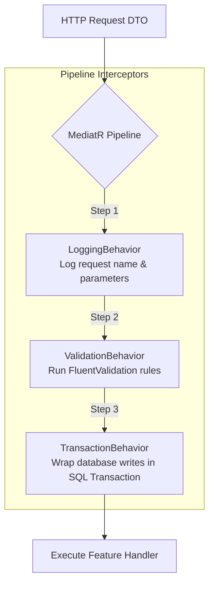

# 04 — Application Layer Design

> **Document ID**: ARC-BE-APP-001  
> **Version**: 1.0  
> **Last Updated**: June 2026  
> **Status**: 🔄 In Review  
> **Format**: CQRS features, pipeline behaviors, and validation design

---

## 1. CQRS Architecture with MediatR

The Application Layer (`AcademicGPA.Application`) orchestrates use cases using the **CQRS (Command Query Responsibility Segregation)** pattern, dispatched via **MediatR**.

*   **Commands**: State-modifying operations (create, update, delete). They return small identifiers or status outputs (e.g. `CreateCourseCommand` returns a `Guid`).
*   **Queries**: Read-only operations. They return data transfer objects (DTOs) and must not modify the database state.

---

## 2. Feature Slicing Folder Layout

To keep the project maintainable, the Application Layer organizes handlers by feature folders:

```
AcademicGPA.Application/
└── Features/
    ├── Semesters/
    │   ├── Commands/
    │   │   ├── CreateSemester/
    │   │   │   ├── CreateSemesterCommand.cs          # The request model
    │   │   │   ├── CreateSemesterCommandValidator.cs # FluentValidation rules
    │   │   │   └── CreateSemesterCommandHandler.cs   # Core execution logic
    │   │   └── DeleteSemester/
    │   └── Queries/
    │       ├── GetSemestersList/
    │       └── GetSemesterDetail/
    └── Courses/
```

---

## 3. MediatR Pipeline Behaviors

The system registers middleware pipeline behaviors that intercept requests before they reach the handlers:



### 3.1 ValidationBehavior
*   Locates all registered validators (`IValidator<TRequest>`) matching the incoming command or query.
*   Executes validations. If errors occur, it aborts execution and throws a custom `ValidationException` (preventing database updates with invalid data).

### 3.2 LoggingBehavior
*   Logs the request name and parameter data details before execution, tracking completion and execution durations.

---

## 4. Application Exception Hierarchy

Application-specific exceptions include:
*   `ValidationException`: Contains a dictionary of property-specific validation errors.
*   `NotFoundException`: Thrown if a requested resource does not exist.
*   `UnauthorizedException` / `ForbiddenException`: Thrown if credentials are invalid or permissions check fails.

---

*End of Document — Application Layer Design*
