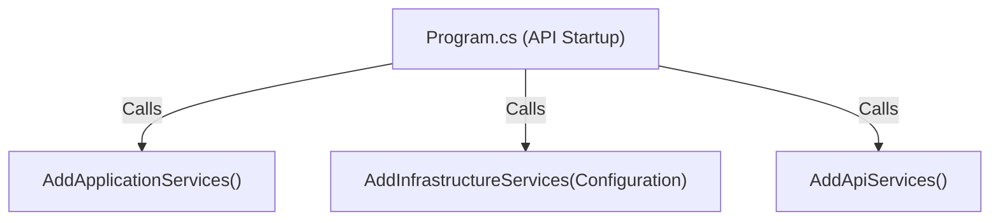

# 07 — Dependency Injection Design

> **Document ID**: ARC-BE-DI-001  
> **Version**: 1.0  
> **Last Updated**: June 2026  
> **Status**: 🔄 In Review  
> **Format**: IoC registration rules and container lifetimes mapping

---

## 1. Dependency Registration Strategy

To keep configuration clean and modular, each layer in the Clean Architecture boundary exposes a static **Dependency Injection Extension Class** containing registration helpers.

---

## 2. Layer Registration Extensions

### 2.1 Application Layer Extension (`AddApplicationServices`)
*   Registers MediatR pipeline behaviors and features.
*   Scans the assembly to auto-register all FluentValidation validators (`IValidator<T>`) as Transient services.
*   Registers AutoMapper profiles.

### 2.2 Infrastructure Layer Extension (`AddInfrastructureServices`)
*   Configures database contexts and connection strings.
*   Registers SQL repositories (Scoped lifetimes).
*   Registers external service clients (`EmailService`, `GoogleAuthService`, `AiAdvisorService`).

### 2.3 API Layer Extension (`AddApiServices`)
*   Configures controllers, JWT authentication properties, and authorization policies.
*   Configures Swagger definitions and rate-limiting rules.

---

## 3. Dependency Lifetime Mapping

Services must follow strict lifetime mappings to prevent memory leaks and concurrency issues:

| Service Category | Interface Example | Lifetime | Rationale |
|:---|:---|:---:|:---|
| **Database Context** | `IApplicationDbContext` | Scoped | Matches database transactions with the HTTP request boundary. |
| **SQL Repositories** | `ICourseRepository` | Scoped | Uses the DbContext instance allocated to the active HTTP request. |
| **Use Case Validators**| `IValidator<CreateCourseCommand>`| Transient | Fast instantiations, containing no state. |
| **MediatR Pipeline** | `IPipelineBehavior<T, U>`| Transient | Resolved on demand for each command. |
| **External Clients** | `IEmailService` | Transient | Lightweight adapters that do not hold state. |
| **Security Generators**| `IJwtService` | Singleton | Thread-safe key signing, containing no state. |
| **Telemetry & Alerts** | `IPrometheusMetrics` | Singleton | Collects metrics across the entire application lifecycle. |

---

*End of Document — Dependency Injection Design*
