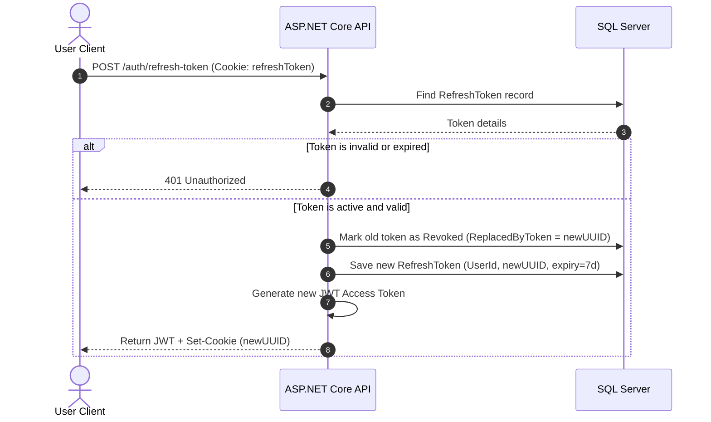

# 08 — Authentication Design

> **Document ID**: ARC-BE-AUTH-001  
> **Version**: 1.0  
> **Last Updated**: June 2026  
> **Status**: 🔄 In Review  
> **Format**: Cryptographic authentication protocols and data structures

---

## 1. Document Purpose

This document details the backend authentication design of the system, specifying the structure of JWT claims, refresh token rotation (RTR) workflows, and Google OAuth integrations.

---

## 2. JWT Access Token Specifications

*   **Signature Algorithm**: HMAC SHA-256 (`HS256`).
*   **Expiration Duration**: exactly 15 minutes.
*   **Claims Structure**:
    ```json
    {
      "sub": "user-guid-id-value",
      "email": "student@domain.com",
      "role": "Student",
      "studentProfileId": "student-profile-guid-id-value",
      "nbf": 1719244800,
      "exp": 1719245700,
      "iss": "gpa-api-server",
      "aud": "gpa-client-app"
    }
    ```

---

## 3. Refresh Token Rotation (RTR) Workflow

To prevent session hijacking, refresh tokens use a rotation strategy:



### 3.1 Breach Mitigation (Token Reuse)
If an old, revoked refresh token is presented, the system assumes a token theft attempt has occurred. It immediately revokes the entire token family (all related active tokens for that user), forcing all sessions to log out and require re-authentication.

---

## 4. Google OAuth 2.0 Integration Flow

*   **Step 1: Auth Code Exchange**: The API receives the Google authorization code from the client.
*   **Step 2: Sign Verification**: The backend calls Google's token endpoint to exchange the code for a verified identity token (JWT).
*   **Step 3: Identity Mapping**:
    *   The backend extracts the user's Google ID and email.
    *   If the user exists, it updates their login history.
    *   If the user does not exist, a new account is registered and verified automatically.
*   **Step 4: Token Issuance**: The API returns a JWT access token and sets a secure refresh token cookie.

---

*End of Document — Authentication Design*
