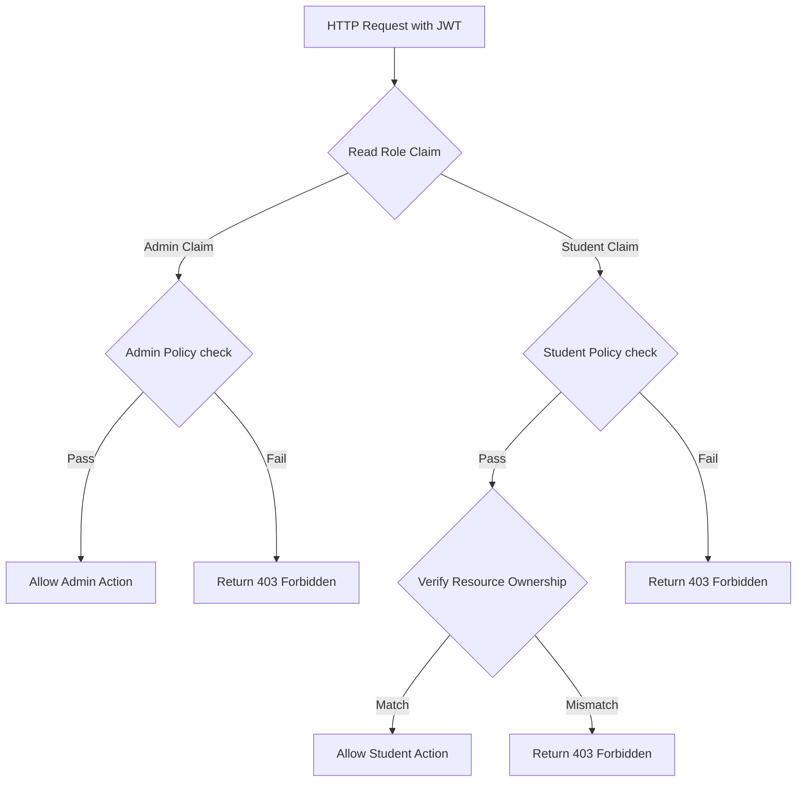

# 09 — Authorization Design

> **Document ID**: ARC-BE-AUTHZ-001  
> **Version**: 1.0  
> **Last Updated**: June 2026  
> **Status**: 🔄 In Review  
> **Format**: Role policies and ownership validation rules

---

## 1. Document Purpose

This document details the authorization engine of the backend API, specifying role-based policies and resource ownership verification rules.

---

## 2. Role-Based Policies

The system enforces access control using ASP.NET Core **Policy-Based Authorization**:

### 2.1 Admin Policy (`PolicyName: RequireAdmin`)
*   **Enforcement**: Restricts access to administrators. Applied using `[Authorize(Policy = "RequireAdmin")]` on controller classes or actions.
*   **Actions**: Standard student accounts attempting to call these endpoints are blocked and receive a `403 Forbidden` response.

### 2.2 Student Policy (`PolicyName: RequireStudent`)
*   **Enforcement**: Restricts access to students. Applied using `[Authorize(Policy = "RequireStudent")]`.

---

## 3. Resource Ownership Verification (Multi-Tenant isolation)

Even if a user is authenticated as a student, they must not be allowed to access another student's academic records. The system enforces strict resource ownership checks in the Application layer before executing commands or queries:

### 3.1 Verification Process
1.  **Retrieve Current User ID**: The handler gets the current user's ID from the injected `ICurrentUserService`.
2.  **Load Target Entity**: The handler loads the requested academic entity (e.g. Course, Semester, AcademicYear) from the repository, including its parent relationships up to the `StudentProfile`.
3.  **Validate Ownership**:
    *   The handler verifies that the entity's `StudentProfileId` matches the current user's profile ID.
    *   If the IDs do not match, the system immediately aborts the operation and throws a custom `ForbiddenException`, which is returned to the client as a `403 Forbidden` response.

---

*End of Document — Authorization Design*
