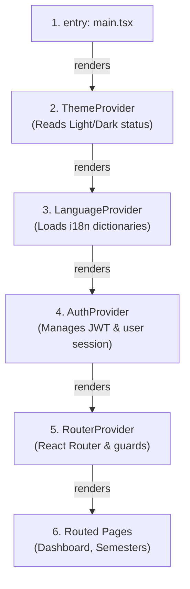
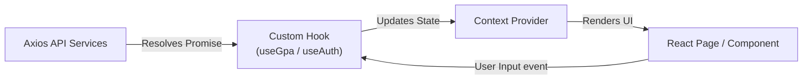

# 02 — Application Architecture

> **Document ID**: ARC-FE-APP-001  
> **Version**: 1.0  
> **Last Updated**: June 2026  
> **Status**: 🔄 In Review  
> **Format**: Frontend data flows and context provider hierarchies

---

## 1. Context Providers Hierarchy

Global state context wrappers are nested in a specific order to ensure configuration settings are available to the rest of the application:

### 1.1 Provider Roles
1.  **ThemeProvider**: Positioned at the root to prevent screen flashing when toggling themes.
2.  **LanguageProvider**: Provides localization settings to all nested child components.
3.  **AuthProvider**: Manages user sessions. It must be nested inside the language provider to ensure authentication error messages are rendered in the user's preferred language.
4.  **RouterProvider**: Handles route mapping and navigation guards based on user authorization claims.

---

## 2. Dynamic Component Data Flow

Data flows through the application using a unidirectional model:

1.  **Event Dispatch**: The user inputs a grade or changes a setting in a React component, triggering an action in a custom hook (e.g. `useGpa`).
2.  **API Execution**: The custom hook calls the corresponding service in the `/api` directory to make an HTTP request.
3.  **State Synchronization**: When the API resolves, the custom hook updates the context state, which triggers a re-render of the relevant UI components.

---

*End of Document — Application Architecture*
