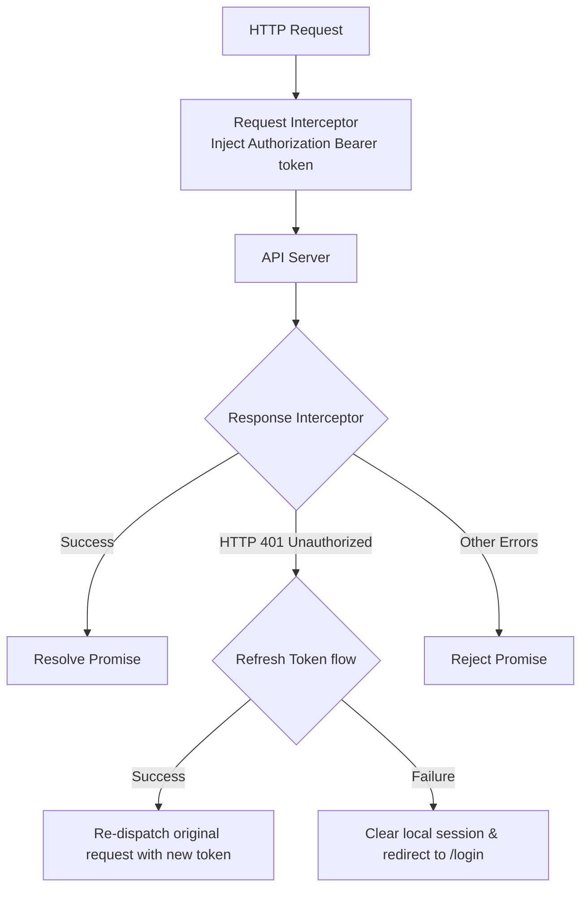

# 07 — API Communication Layer

> **Document ID**: ARC-FE-API-001  
> **Version**: 1.0  
> **Last Updated**: June 2026  
> **Status**: 🔄 In Review  
> **Format**: HTTP client interceptors and API service structures

---

## 1. Centralized HTTP Client (Axios)

The frontend uses **Axios** to manage API communication. All endpoints share a single configured Axios client instance (`/api/axiosInstance.ts`).

---

## 2. Request & Response Interceptors

The Axios client registers interceptors to automate header injection, token rotation, and exception handling:

### 2.1 Request Interceptor (Header Injection)
Before a request is sent, the interceptor checks if a JWT access token exists in memory. If present, it injects the token in the `Authorization: Bearer <Token>` header.

### 2.2 Response Interceptor (Token Refresh Flow)
If the API returns a `401 Unauthorized` status (indicating an expired JWT access token):
1.  **Block Requests**: The interceptor pauses outgoing requests to prevent multiple redundant refresh attempts.
2.  **Request Token Refresh**: The client calls `POST /auth/refresh-token` (the browser sends the secure HttpOnly refresh token cookie automatically).
3.  **Process Queue**:
    *   *If Refresh Succeeds*: Updates the access token in memory, updates headers, and re-dispatches the queued requests.
    *   *If Refresh Fails*: Clears the local session, redirects the user to `/login`, and displays a session timeout alert.

---

## 3. Modular API Service Wrappers

To keep components decoupled from URL definitions, calls are wrapped inside modular service classes:

*   `authApi.ts`: Login, registration, password recovery calls.
*   `courseApi.ts`: Course additions, updates, deletions.
*   `gpaApi.ts`: GPA summaries and aggregates calculators.
*   `aiAdvisorApi.ts`: Chat message submissions and histories.

---

*End of Document — API Communication Layer*
