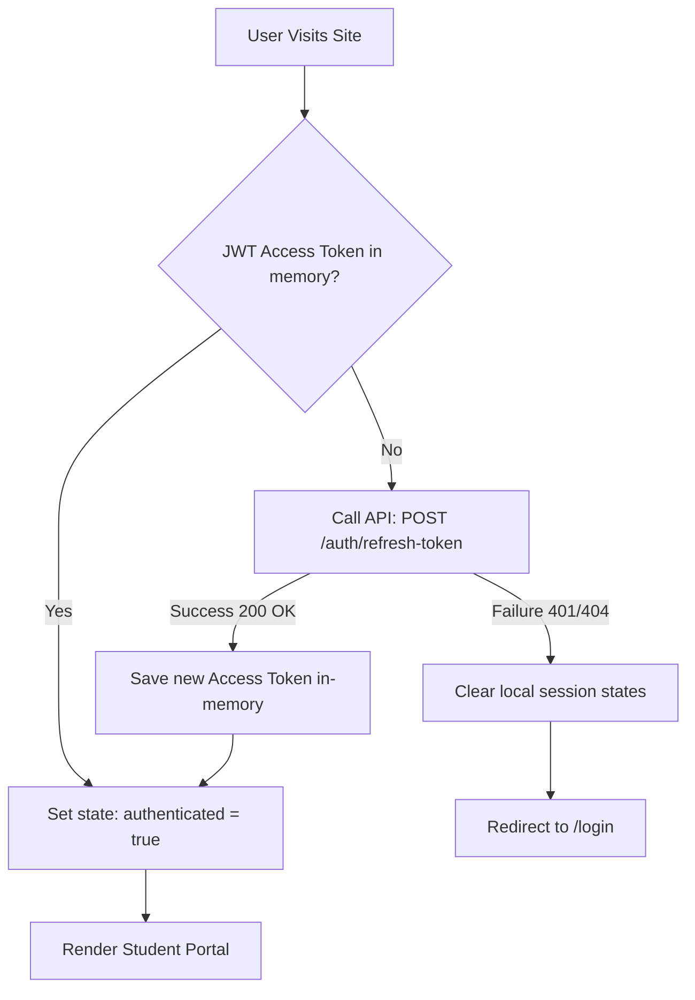

# 10 — Authentication Flow

> **Document ID**: ARC-FE-AUTH-001  
> **Version**: 1.0  
> **Last Updated**: June 2026  
> **Status**: 🔄 In Review  
> **Format**: Client-side authentication state flows and page redirection pipelines

---

## 1. Document Purpose

This document details the frontend authentication flow, specifying token storage, redirection rules, and session refresh pipelines.

---

## 2. Authentication State Pipeline

The frontend coordinates authentication through the `AuthContext`:

---

## 3. Redirection Rules

The client router enforces access control and manages redirects during authentication events:

1.  **Successful Sign-in**: Redirects students to `/dashboard` and administrators to `/admin/dashboard`.
2.  **Explicit Logout**: Clears the access token from memory, requests token revocation from the API, and redirects the user to `/login`.
3.  **Onboarding Requirement**: If a logged-in student has not completed their profile setup (e.g. `studentCode` is null), the router intercepts the navigation and redirects them to the onboarding sheet.

---

## 4. Google OAuth 2.0 Client-Side Integration

*   **OAuth Authorization**: Clicking the "Sign in with Google" button redirect the user to Google's OAuth consent screen.
*   **Authorization Code Redirect**: After consent, Google redirects the browser back to the application (`/login/callback`) with an authorization code.
*   **Authentication Completion**: The callback page extracts the authorization code from the URL, dispatches it to the backend (`POST /auth/google`), and processes the response to complete the sign-in flow.

---

*End of Document — Authentication Flow*
