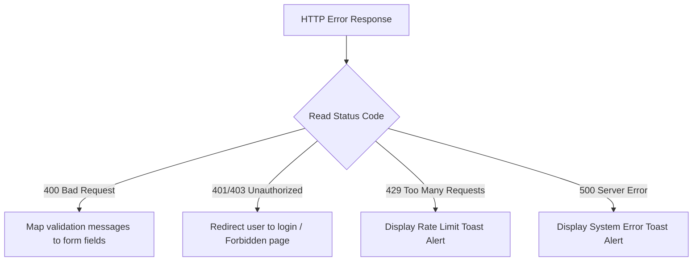

# 14 — Client-Side Error Handling

> **Document ID**: ARC-FE-ERR-001  
> **Version**: 1.0  
> **Last Updated**: June 2026  
> **Status**: 🔄 In Review  
> **Format**: Error interceptors and UI error boundary specifications

---

## 1. Document Purpose

This document details the frontend error handling strategy, specifying Axios interceptors, toast notifications, and React error boundary components.

---

## 2. React Error Boundary Components

To prevent the entire application from crashing when a component throws an unhandled error, the system uses **React Error Boundaries**:

*   **Boundary Wrapper (`ErrorBoundary.tsx`)**:
    *   Wraps high-level page layouts inside the Router component.
    *   **Behavior**: Catches rendering exceptions in child components, logs the error stack to the console, and displays a localized fallback UI (reusing our [500 Internal Error Page](./../uiux/16-error-pages.md#23-500-internal-server-error)) instead of crashing the page.

---

## 3. Axios Interceptor Error Mapping

When an API request fails, the Axios response interceptor parses the error payload:

### 3.1 Validation Error Mapping (400 Bad Request)
If the API returns a validation error payload (RFC 7807), the form handler parses the response errors list and applies them directly to the corresponding React Hook Form input fields using `setError()`.

### 3.2 System & Timeout Toasts (500 / Network Error)
If a request fails due to a server error or timeout, the interceptor displays a warning toast notification containing the localized message: "Đã xảy ra lỗi kết nối. Vui lòng thử lại sau. / A connection error occurred. Please try again later."

---

*End of Document — Client-Side Error Handling*
