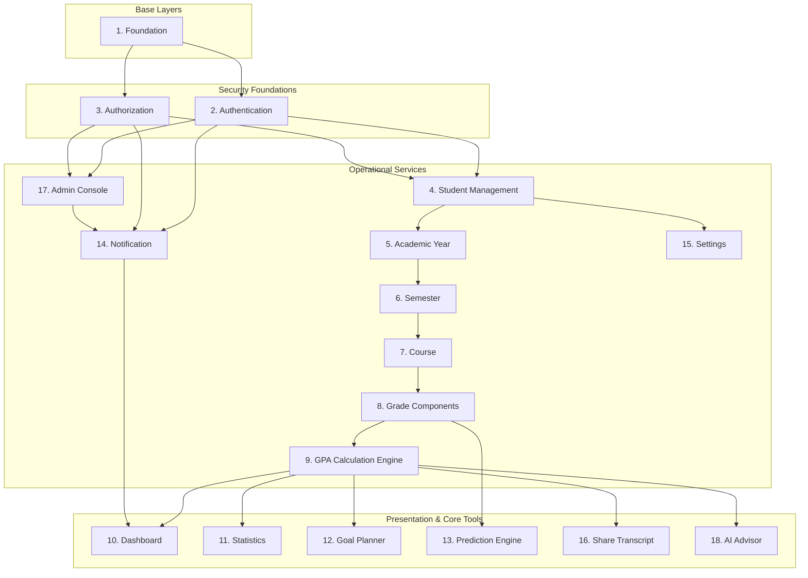

# 03 — Dependency Map

> **Document ID**: PLN-DEP-001  
> **Version**: 1.0  
> **Last Updated**: June 2026  
> **Status**: 🔄 In Review  
> **Format**: Module dependency matrix and architectural relationship diagrams

---

## 1. Document Purpose

This document details the dependencies and integration paths between the 18 system modules of the Academic GPA Management System. It highlights critical nodes, tracks transitive dependencies, and guides the execution order to minimize integration issues.

---

## 2. Structural Dependency Hierarchy

The diagram below represents the dependency relationships between modules. Bottom-tier modules must be stabilized before top-tier integrations can proceed.

---

## 3. Dependency Matrix

The table below catalogs the direct and transitive dependencies for all 18 modules:

| Module ID | Module Name | Direct Dependencies | Transitive Dependencies | Impact Level |
|:---:|:---|:---|:---|:---:|
| **M01** | Foundation | None | None | Critical |
| **M02** | Authentication | M01 | None | Critical |
| **M03** | Authorization | M02 | M01 | High |
| **M04** | Student Management | M02, M03 | M01 | Medium |
| **M05** | Academic Year | M04 | M01, M02, M03 | Low |
| **M06** | Semester | M05 | M01, M02, M03, M04 | Low |
| **M07** | Course | M06 | M01, M02, M03, M04, M05 | Medium |
| **M08** | Grade Components | M07 | M01, M02, M03, M04, M05, M06 | Medium |
| **M09** | GPA Engine ⭐ | M08 | M01, M02, M03, M04 to M07 | Critical |
| **M10** | Dashboard | M09, M14 | M01 to M08 | Medium |
| **M11** | Statistics | M09 | M01 to M08 | Medium |
| **M12** | Goal Planner | M09 | M01 to M08 | Medium |
| **M13** | Prediction Engine | M08 | M01 to M07 | Low |
| **M14** | Notification | M02, M03 | M01 | Medium |
| **M15** | Settings | M04 | M01, M02, M03 | Low |
| **M16** | Share Transcript | M09 | M01 to M08 | Medium |
| **M17** | Admin Console | M02, M03, M14 | M01 | High |
| **M18** | AI Advisor | M09, M01 | M01 to M08 | High |

---

## 4. Critical Path Analysis & Risk Management

To avoid project bottlenecks, three modules require strict testing and validation because they form the foundation for all subsequent work:

### 1. Foundation (M01)
*   **Role**: Provides the database context and basic API response wrapper models.
*   **Risk**: Any structural changes here will require updates across all 17 other modules.
*   **Mitigation Strategy**: The database connection configurations, exception handling models, and API envelope contracts must be completed, reviewed, and signed off in the first week.

### 2. Authentication (M02) & Authorization (M03)
*   **Role**: Manages security claims and routes requests for both students and admins.
*   **Risk**: Security vulnerabilities or integration failures will block all other API testing.
*   **Mitigation Strategy**: Develop token generation and JWT signature checks early. Use mock contexts to test user profiles while authentication is being completed.

### 3. GPA Engine (M09)
*   **Role**: Converts score records into GPA metrics.
*   **Risk**: Other modules (Dashboard, Statistics, Goal Planner, Share Transcript, AI Advisor) depend on its outputs. Any errors in the calculations will impact the entire system.
*   **Mitigation Strategy**: Develop the GPA Engine with 100% unit test coverage based on the BR-CALC specifications before building the frontend screens.

---

*End of Document — Dependency Map*
