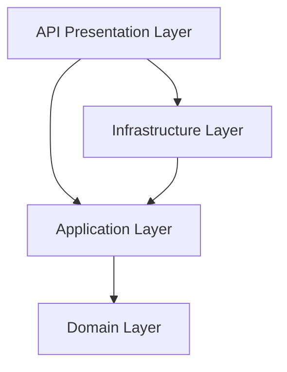

# Architecture Review — Clean Architecture & SOLID Compliance

The Academic GPA Management System is designed and structured under strict **Clean Architecture** guidelines and **SOLID** principles.

---

## 1. Clean Architecture Layers

### Domain Layer (`AcademicGPA.Domain`)
- **Role**: Contains the enterprise entities, value objects, domain exceptions, and base constructs.
- **Dependencies**: Zero external dependencies. Fully decoupled from ORMs and external frameworks.
- **Key Files**: [Score.cs](file:///d:/aiiii/backend/src/AcademicGPA.Domain/Entities/Score.cs), [CourseGrade.cs](file:///d:/aiiii/backend/src/AcademicGPA.Domain/Entities/CourseGrade.cs).

### Application Layer (`AcademicGPA.Application`)
- **Role**: Contains application use cases, DTOs, CQRS commands/queries, and interfaces.
- **Dependencies**: Depends only on the Domain Layer.
- **Frameworks**: MediatR (CQRS workflow), FluentValidation (request validation).

### Infrastructure Layer (`AcademicGPA.Infrastructure`)
- **Role**: Implements interfaces defined in the Application layer, providing data access, password hashing, and service clients.
- **Dependencies**: Depends on the Application Layer.
- **Frameworks**: EF Core, BCrypt/PBKDF2.
- **Key Files**: [GpaCalculator.cs](file:///d:/aiiii/backend/src/AcademicGPA.Infrastructure/Services/GpaCalculator.cs), [PredictionService.cs](file:///d:/aiiii/backend/src/AcademicGPA.Infrastructure/Services/PredictionService.cs).

### Presentation Layer (`AcademicGPA.API`)
- **Role**: Exposes REST endpoints to client applications, handles JWT token validation, and manages the global HTTP request lifecycle.
- **Dependencies**: Depends on Application and Infrastructure layers.

---

## 2. SOLID Principles Compliance

- **Single Responsibility (SRP)**:
  - Controllers only route requests (e.g. `CoursesController`).
  - MediatR handlers execute single commands (e.g. `CreateCourseGradeCommandHandler`).
  - Validation is decoupled using pipeline validation behaviors.
- **Open/Closed (OCP)**:
  - GPA calculation algorithm uses structured strategies, enabling new scale mappings without modifying core computation.
- **Liskov Substitution (LSP)**:
  - Repositories and interfaces (e.g. `ICurrentUserService`) can be substituted with mock implementations (e.g., in unit tests) without affecting core application behavior.
- **Interface Segregation (ISP)**:
  - Interfaces are fine-grained (e.g. `IPasswordHasher`, `IJwtService`, `IAiAdvisorClient`), ensuring classes only implement operations they consume.
- **Dependency Inversion (DIP)**:
  - High-level application modules depend on abstractions, not concrete implementations. Dependencies are injected via the ASP.NET Core DI container.
