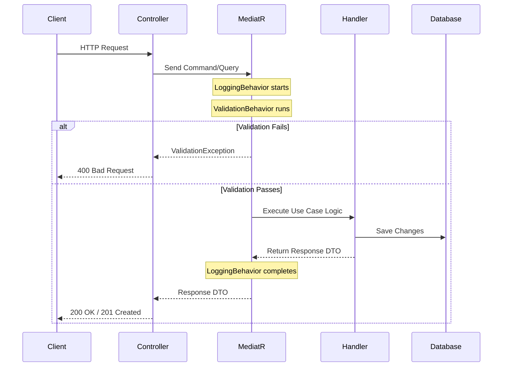

# Backend Review — API design, Pipeline, & Middlewares

The backend API is built using ASP.NET Core 10.0 and structured to separate routing concern from transactional logic using MediatR.

---

## 1. API Design & Routing

All controllers inherit from a base `ApiControllerBase` class and expose RESTful routes:
- **Authentication**: `/api/auth` (Register, Login, Refresh, Logout)
- **Academic Setup**: `/api/academicyears`, `/api/semesters`
- **Courses & Scores**: `/api/courses` (CRUD course grades, update components, recalculate)
- **Settings & Notifications**: `/api/settings`, `/api/notifications`
- **AI Consultation**: `/api/ai` (Start chat, post messages, fetch analyses)
- **Administration**: `/api/admin` (Search/manage users, reset passwords, system-wide metrics)

---

## 2. Request Handling Pipeline (CQRS & MediatR)

The request flow utilizes MediatR Pipeline Behaviors as cross-cutting decorators:

---

## 3. Global Exception Handling

Uncaught exceptions are intercepted by a global custom middleware:
- **`ValidationException`**: Responds with HTTP `400 Bad Request` and returns validation error keys.
- **`NotFoundException`**: Responds with HTTP `404 Not Found` (e.g. course or semester missing).
- **`ForbiddenException`**: Responds with HTTP `403 Forbidden` (e.g., student attempting to edit another student's courses).
- **`UnauthorizedException`**: Responds with HTTP `401 Unauthorized` (e.g. invalid credentials).
- **System Exceptions**: Caught, logged as critical errors with stack traces, and returned to client as generic HTTP `500 Internal Server Error` messages to avoid leaking implementation details.

---

## 4. Logging Engine (Serilog)
- Configured via `Program.cs` and `appsettings.json`.
- Outputs logs structured in JSON format.
- Uses rolling file writers storing logs under `logs/` directory, categorized by log severity (Information, Warning, Error).
