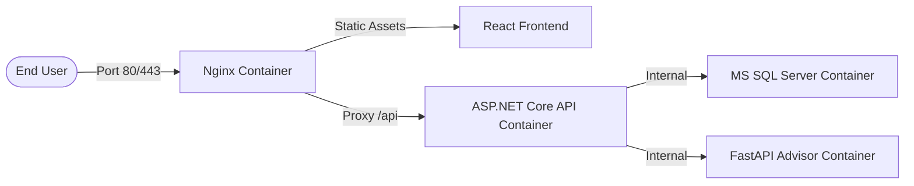

# Deployment Summary — Infrastructure & Containerization

The system is configured with modern DevOps utilities to support automated deployments and reliable service execution.

---

## 1. Container Architecture

The application runs inside isolated Docker containers managed via Docker Compose:

- **Reverse Proxy**: Nginx handles static file hosting and redirects all `/api` requests to the backend, avoiding CORS complications.
- **Production Compose (`docker-compose.prod.yml`)**: Uses custom docker networks. Only Nginx exposes ports to the external host, isolating the database, AI service, and backend API.

---

## 2. Health Monitoring & Verification

- **API Diagnostics**:
  - ASP.NET Core maps the `/health` endpoint using EF Core health diagnostics.
  - FastAPI AI service exposes a `/health` endpoint verifying recommendation engine readiness.
- **Compose Orchestration**:
  - The containers define startup dependencies (`depends_on`) matching service health checks.
  - Ensures the API container starts only after the database is online and initialized.

---

## 3. CI/CD Workflow (`ci-cd.yml`)

- Runs on GitHub Actions.
- Triggered on commits to the `main` branch or pull request reviews.
- **Verification Gates**:
  1. Compiles and runs all 200 backend unit and integration tests.
  2. Runs frontend ESLint scripts and checks production bundle compilation.
  3. Verifies that all Dockerfiles build without compilation failures.

---

## 4. Disaster Recovery & Backup Plan

- **Automated Backup Scripts**:
  - [backup.sh](file:///d:/aiiii/deployment/scripts/backup.sh) invokes [backup.sql](file:///d:/aiiii/deployment/scripts/backup.sql) within the database container to create time-stamped backups in a mounted volume.
- **Restoration Scripts**:
  - [restore.sh](file:///d:/aiiii/deployment/scripts/restore.sh) calls [restore.sql](file:///d:/aiiii/deployment/scripts/restore.sql) to restore the database from a backup.
